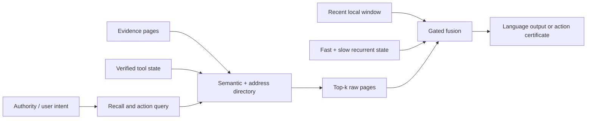

# 7B Agentic Model, Native 262K Context — End-to-End Master Plan v2

**Status:** Internal, decision-gated R&D plan  
**Date:** 2026-07-23  
**Revision:** v2, consolidated after independent architecture, systems, data-rights, and execution review  
**Classification:** Confidential — potential inventions and trade secrets  
**Decision horizon:** architecture authorization at the final proxy gate; full 7B authorization only after a full-width rehearsal

> This document authorizes product validation, data-rights work, proxy research, and systems
> bake-offs. It does not authorize the multi-trillion-token run until the gates in §§6, 9, 10,
> 14, 17, and 20 pass. Architecture, patentability, freedom to operate, copyright, privacy, and
> release terms require separate evidence and qualified counsel. A dataset, model, or code
> repository license label is not a legal conclusion about every underlying artifact.

## 1. Executive decision

Start a new, independently authored model program. Do **not** scale the current Keras/JAX 1B
design into the production 7B model, and do **not** copy Gemma, Qwen, OLMo Hybrid, Kimi Linear,
or Nemotron layer-for-layer.

The recommended product is a text-first, dense, approximately 7B-parameter model with:

- a real maximum context of **262,144 tokens**, certified by capability, memory, and latency tests;
- strong light coding, general assistance, structured output, function calling, terminal/browser/document automation, and multi-step agent behavior;
- an architecture program comparing a dense quality control, a public 3:1 recurrent/attention
  hybrid, and a proprietary long-context candidate based on recurrent state, exact local
  attention, and addressable raw-page recall;
- provenance-aware separation of trusted instructions, untrusted evidence, and verified tool state;
- model/runtime co-design for intent-bound, least-privilege, reversible actions;
- a private workflow-simulation and verifier flywheel that should become the most durable moat.

The architecture is **not locked**. A 3:1 layout, GDN/KDA-style recurrence, output gating,
attention sinks, partial RoPE, MTP, untied embeddings, or a custom `model_type` are public
techniques or implementation choices—not company IP. Originality belongs only in mechanisms,
objectives, data, environments, runtime protocols, kernels, and evaluations that we can specify,
attribute correctly, and prove useful through matched controls.

The 6T main run may start only after the selected configuration passes the final proxy suite and
a 10–30B-token full-width rehearsal covering 72-hour stability, native 262K training, optimizer
and checkpoint recovery, parameter accounting, export, serving memory/throughput, and a matched
lightweight post-training comparison.

### Recommended program thesis

> Build a native-262K, provenance-aware 7B agent model that can locate exact evidence in very long inputs, track changing workflow state, and complete useful actions through verifiable least-privilege execution.

This is a more defensible goal than “another general 7B chat model.”

## 2. What to do with the current repository

The current project is valuable as a pilot and governance asset, but it is not the production training foundation.

### Preserve and reuse

- The completed 250M pilot, its manifests, loss curves, checkpoints, and failure history.
- Data provenance, license-register, data-card, and model-card discipline.
- Atomic checkpointing, resume/canary thinking, run manifests, and frozen-result packets.
- Decontamination and per-source evaluation concepts.
- The proxy-first and hyperparameter-transfer mindset, including the existing muP work, after revalidation in the new stack.
- Safety policy and release-governance structure.

### Rebuild

- Model architecture and tokenizer.
- Distributed trainer and precision path.
- Throughput/MFU accounting.
- Data plane at multi-trillion-token scale.
- Long-context kernels and serving cache manager.
- Post-training, agent environments, action protocol, and evaluation harness.

### Important audit correction

The current throughput history must not be used for cluster economics without recomputation. The pretraining batch is already global, but the throughput benchmark multiplies the resulting token count by device count again. That overstates multi-GPU throughput and MFU by approximately world size. See `scripts/run_pretrain.py` around `batch_pairs` and `scripts/benchmark_throughput.py` around the throughput calculation.

### Lineage action

Tag and freeze this repository as the **legacy 250M/1B pilot lineage**. Create a new private repository for the 7B program with a fresh dependency ledger, tokenizer lineage, data registry, and signed training ancestry. Do not delete the pilot.

## 3. Research snapshot: what the 2026 evidence actually supports

| Reference | What is useful | Why it is not our blueprint |
|---|---|---|
| [Qwen3.5-9B configuration](https://huggingface.co/Qwen/Qwen3.5-9B/blob/main/config.json) | 32-layer 3:1 linear/full-attention hybrid and a 262,144-token configuration prove this scale/context combination is practical. | Copying its Gated DeltaNet schedule, dimensions, and positional recipe would be derivative and gives no company moat. |
| [OLMo Hybrid 7B](https://allenai.org/blog/olmohybrid) | Controlled 7B evidence that a recurrent/attention hybrid can outperform a comparable Transformer and use training tokens more efficiently. | It is a research base model with a 64K-class context, and its simple 3:1 replacement pattern is now crowded public art. |
| [Kimi Linear](https://arxiv.org/abs/2510.26692) | Strong large-scale evidence for hybrid linear attention, lower KV use, and long-context throughput. | The released experiment is a 48B-total/3B-active architecture using KDA and MLA, not a small dense recipe. |
| [Nemotron 3](https://research.nvidia.com/labs/nemotron/Nemotron-3/) | Hybrid recurrence/attention/MoE, multi-environment RL, and up to 1M context show the direction is production-relevant. | A roughly 31.6B-total model and MoE serving footprint are unnecessary risk for a first 7B product. |
| [Gemma 4 model card](https://ai.google.dev/gemma/docs/core/model_card_4) | 128K/256K contexts, local/global attention, reasoning modes, function calling, and multimodality are useful product references. | There is no conventional 7B/256K Gemma recipe; the smaller effective models use different total/active parameter designs. |
| [Native Sparse Attention](https://arxiv.org/abs/2502.11089) | Hierarchical compression plus selected fine-grained tokens is credible prior art for efficient long-context training. | Ordinary compression-plus-top-k selection cannot be represented as our invention. |
| [Landmark Attention](https://arxiv.org/abs/2305.16300) | Learned block landmarks can select raw context blocks for exact access. | It is close prior art for in-model page retrieval and must be in the claims/FTO matrix. |
| [Infini-attention](https://arxiv.org/abs/2404.07143) and [Titans](https://arxiv.org/abs/2501.00663) | Bounded/compressive or learned long-term memory can extend beyond normal attention windows. | Both leave material scale, serving, reproducibility, and exact-recall questions for this product. |

Two findings materially change the design process:

1. Ai2’s controlled [OlmPool study](https://allenai.org/blog/olmpool) reports that QK normalization, aggressive GQA, sliding-window attention, and short pretraining contexts can compound into severe long-context degradation. We therefore must ablate these choices early; none is frozen in this plan.
2. Ai2’s [hybrid token analysis](https://allenai.org/blog/hybrid-token-prediction) finds recurrence stronger for evolving semantic state while attention retains an advantage for verbatim lookup. That supports a model with both a state path and an exact-evidence path.

Needle retrieval alone is not enough. [RULER](https://arxiv.org/abs/2404.06654), [HELMET](https://arxiv.org/abs/2410.02694), and [NoLiMa](https://arxiv.org/abs/2502.05167) all show that claimed context length can substantially exceed effective retrieval and reasoning length.

Public extension recipes also show that target-length exposure cannot be skipped. [Qwen2.5-1M](https://qwenlm.github.io/blog/qwen2.5-1m/) used a progressive 4K→32K→64K→131K→262K curriculum before extrapolating farther. [ProLong](https://arxiv.org/abs/2410.02660) found that a mixture retaining substantial short data outperformed long-only continuation and used tens of billions of target-length tokens. These are controls, not recipes to copy blindly.

## 4. V1 product specification

### Required capabilities

- General question answering, summarization, rewriting, planning, and document help.
- Python, JavaScript/TypeScript, shell, SQL, YAML/JSON, and common web/backend code assistance.
- Fill-in-the-middle, diffs, test repair, repository navigation, and multi-file light changes.
- Valid JSON/schema outputs, single/parallel tool calls, clarification, retries, and failure recovery.
- Terminal, filesystem, browser/search, document, spreadsheet, email/calendar, database, and SaaS automation through adapters.
- Low/normal/high reasoning budget without requiring a different checkpoint.
- Low/balanced/exact **context-recall budget**, separately controllable from reasoning budget.
- Citations to context segments and tool observations for consequential claims/actions.
- a **262,144-token combined prompt-plus-generation budget**. Default mode reserves 16,000
  generation tokens and accepts up to 246,144 prompt tokens; a 250,000-token-input mode reserves
  12,144 generation tokens. Larger output or 512K support is a later, separately certified target.

### V1 non-goals

- Beating frontier 100B+ models at every academic benchmark.
- Native image/audio/video training inside the first base run.
- A large MoE model hidden behind a 7B “active parameter” label.
- Fully autonomous high-impact actions without deterministic authorization and rollback controls.
- Marketing 262K because a config file accepts it.

Multimodality should be a V1.1 encoder/adaptor program after the text/agent foundation is stable.

## 5. Proprietary architecture R&D

### 5.0 Four-lane rule

Carry four isolated lanes through the proxy gates:

1. **Dense quality control:** a conventional decoder-only Transformer. Compare MHA with moderate
   GQA; do not assume QK norm, sliding windows, sandwich norms, or a positional extension method.
2. **Public hybrid control:** a documented 3 recurrent/linear-attention blocks to 1 global
   softmax-attention block layout using a public operator such as GDN/KDA. This is an efficiency
   baseline, not proprietary architecture.
3. **Proprietary operator candidate:** Structure-Aware Page Memory or another company-designed
   state, routing, compression, or exact-recall mechanism with equations, a tensor census,
   independently authored kernels, a prior-art delta, and an isolated ablation.
4. **Proprietary training candidate:** the public hybrid control plus exactly one company-designed
   objective or curriculum. Training innovation and architecture innovation are evaluated
   separately before they may be combined.

Output gates, sinks, positional choices, MTP, GQA, and memory features are independent factors.
They may not be bundled and branded as an original architecture without isolated evidence and a
measured interaction benefit. If Lane 3 fails, ship the strongest public-control-derived model and
claim exclusivity only in assets and methods that are genuinely ours.

### 5.1 Working candidate: Structure-Aware Page Memory

This is a research candidate and provisional internal name, not a novelty claim.

Illustrative envelope, to be frozen only after the final proxy gate:

- **7.0–7.8B complete base-generation parameters**, including embeddings and LM head;
- **at most 8.0B serialized parameters**, including detachable MTP or auxiliary heads;
- 32–36 decoder blocks and hidden width around 3,584–4,096, selected by measured scaling rather
  than copied dimensions;
- 128K company-trained tokenizer target; a larger vocabulary requires tokenizer evidence and a
  revised tensor census;
- dense SwiGLU feed-forward blocks;
- recurrent-state (`R`), exact-local-attention (`L`), and addressable-directory (`D`) mixers;
- initial research schedule only: `[R, R, L, R, R, L, R, D] × 4`;
- native maximum length 262,144;
- initial local window 8,192 and physical page size 512 tokens.

“7B” always means the complete generation model, not a core count that excludes embeddings,
output projection, recurrence, or memory. Before architecture freeze, a generated configuration
sheet must enumerate every tensor and report base, embedding, LM-head, recurrent-state,
directory, MTP, and inactive memory parameters separately.

At 262,144 tokens, a 512-token page produces exactly 512 pages. Each completed page creates:

- a semantic summary for meaning-based lookup;
- an address/evidence sketch optimized for identifiers, symbols, numbers, paths, citations, and tool-state references;
- structure features such as file/symbol/diff boundaries, message and tool-call boundaries, source provenance, and verified state checkpoints.

A directory layer first ranks page summaries and then performs exact attention over raw K/V from selected pages plus recent local context. It is not a periodic full-attention layer and does not force every layer to retain a 262K KV cache.

### 5.2 Dual-rate state candidate

Do not adopt Gated DeltaNet or Mamba under a new name. Develop and ablate a separate two-timescale state hypothesis:

- a fast state tracks token-level changes and recent workflow transitions;
- a slow state stores durable events and decisions;
- write and erase controls are independent;
- at fixed 512-token boundaries, a consolidation operation can transfer a low-rank change from fast to slow state;
- consolidation can use boundary type, novelty, read error, and—during agent post-training—verified tool outcomes;
- queries read both states through a learned mixture.

The fixed boundary is important for parallel-scan training. Variable semantic boundaries are a later experiment only if the fixed version wins.

Prior-art overlap with KDA, Gated DeltaNet, Mamba, Titans, and multi-timescale RNNs is substantial. The candidate must be judged by measured behavior and counsel-led search, not by internal naming.

### 5.3 Budget-conditioned exact recall

One checkpoint should support nested recall budgets:

- **low:** top 8 pages;
- **balanced:** top 32 pages;
- **exact:** top 128 pages.

The ranking is shared so the selected sets are nested. Joint training should include high-to-low distillation and a monotonic evidence-coverage objective. The runtime chooses higher recall for risky actions, large repositories, and evidence-sensitive tasks.

This gives a product-level latency/quality control independent of “thinking tokens.”

### 5.4 Provenance-gated memory

Prompt injection is fundamentally relevant to an agent that reads repositories, webpages, email, and tool results. Recent work links attacks to latent role confusion ([Prompt Injection as Role Confusion](https://arxiv.org/abs/2603.12277)) and argues that shared control/data pipelines cannot perfectly separate instructions from data ([Inseparability of Instructions and Data](https://arxiv.org/abs/2606.27567)). [CaMeL](https://arxiv.org/abs/2503.18813) is important prior art for control/data-flow and capability separation.

The model candidate should therefore test separate, runtime-assigned memory banks for:

- **Authority:** authenticated policy, user intent, and approvals;
- **Evidence:** repository text, webpages, documents, email bodies, and ordinary tool output;
- **Verified state:** independently checked environment state and executed-action results.

The provenance comes from the runtime, never from text claiming to be “system” or “verified.” Static cross-bank read/write rules prevent evidence from promoting itself into authority memory. The action path must identify authority and supporting evidence spans.

This is defense in depth, not a standalone security boundary. A deterministic broker still owns permissions and execution.

### 5.5 Position representation

Do not freeze “large-theta RoPE everywhere.” Compare:

1. standard RoPE/YaRN control;
2. partial or local-only RoPE;
3. factorized page-index plus within-page offsets;
4. logarithmic relative page-distance buckets plus exact within-page coordinates;
5. randomized long-range position exposure during short-sequence training.

The page/state design should avoid depending on untrained absolute positions at 262K. Position experiments must run at 128K and 262K during proxy development, not after the 7B architecture is fixed.

### 5.6 Parameter and cache envelope

The exact parameter count depends on the winning recurrent cell and embedding tying. Use approximately 7B as an engineering class, not a branding constraint that forces a worse shape.

Vocabulary cost is load-bearing: a 131,072-token table contains about 470M parameters at width
3,584 and 537M at width 4,096. Untying input and output tables doubles those figures. Tied versus
untied embeddings is therefore a measured quality/size decision, not a default. Every candidate
must be admitted by the complete tensor census above.

Use the frozen configuration for cache estimates:

`KV bytes = 2 × cached layers × KV heads × head dimension × cached tokens × bytes per element`

For comparison, a conventional 32-layer model with 8 KV heads, 128-dimensional heads, and BF16 KV requires about **32 GiB per 262K sequence**; FP8 KV still requires about **16 GiB**.

The initial Page Memory cache target is:

- four directory layers retaining raw FP8 K/V with 6 KV heads: about **1.5 GiB**;
- eight local layers retaining an 8K FP8 window: about **96 MiB**;
- directory summaries and recurrent/conv states: separately measured and reported;
- total model-specific long-context-state research target: **under 2 GiB per sequence** before
  allocator, runtime workspace, weights, fragmentation, graph capture, and safety reserve.

Because GQA can change long-context quality, 6 KV heads is a systems challenger, not a frozen
choice. Compare capacity-preserving options at proxy scale. Concurrency is never inferred from
raw HBM divided by KV bytes: the serving report must measure prompt-plus-output occupancy, TTFT,
prefill/decode throughput, peak HBM, and 1/4/8-request concurrency on the exact B200/B300 SKU.

## 6. Architecture controls and kill gates

All comparisons use matched data, tokenizer, token count, parameter envelope, training FLOPs,
context distribution, and lightweight post-training. Report confidence intervals. Feature bundles
are tested only after the individual effects are established. Required controls are:

- a full Transformer control;
- a local/global Transformer control;
- a public-style 3:1 Gated-Delta/full-attention hybrid control;
- a recurrent-plus-local control with no page directory.

### Experiment ladder

| Scale | Budget | Purpose | Authorization gate |
|---|---:|---|---|
| 150–200M | ~5B tokens, 3 seeds | Reference implementation, kernel correctness, synthetic state/copy/retrieval tests | No unexplained divergence; BF16 reference parity; gradients and checkpoint resume correct |
| ~350M | ~20B tokens, 3 seeds | Factorial ablations of state, page memory, provenance, positions, GQA/QK norm, and recall budgets | A candidate wins a pre-registered capability/efficiency score, not one cherry-picked metric |
| ~1–1.3B | ~100B tokens, at least 3 seeds for finalists | Dense control, public hybrid, public hybrid + one proprietary operator, and public hybrid + one proprietary objective on real repositories, long documents, and agent histories | Reproduced gain at 262K; production kernel works; serving profile and initial IP review complete |
| Full-width 7B rehearsal | 10–30B tokens | Final width/depth, intended optimizer and mesh, short plus 32K/128K/262K sequences, identical lightweight SFT, export and serve | At least 72 continuous hours; arbitrary resume; loss/throughput in envelope; production serving path works |
| 7B base | 6T committed; 8T planned | Production base model | Only after every earlier gate and complete data ledger are signed |

The wind-tunnel budget must be calculated from declared parameters, tokens, sequence-length mix,
attention operations, seed count, evaluations, and failed-run reserve. It may not be described as a
percentage of the main run until that accounting exists.

### Promotion and fallback table

| Area | Promotion gate | Failure action |
|---|---|---|
| Base quality | Validation loss within 0.5% relative and downstream aggregate within 1 point of the strongest matched control | Reject the candidate |
| Code/exact copy | No more than 2 points below the dense control | Reject or retain dense layers until recovered |
| Long context | At least 85% score retention at every registered bucket and at least 95% exact-evidence retrieval at 250K | Do not claim 262K; delay or release at the validated length |
| Training stability | No NaNs, unexplained spikes, emergency optimizer changes, or persistent logit/state growth in the 72-hour rehearsal | Revert the operator/optimizer and repeat the rehearsal |
| System value | Material measured gain in training wall time, prefill, decode, or cache after all overheads | Use the simpler control |
| Proprietary operator | Statistically credible benefit over the public hybrid at matched cost, plus a written prior-art delta | Remove it and make no architecture-IP claim |
| Page memory | At least 2 target-task points, page-selector recall above 98%, and less than 5% end-to-end serving-cost increase at the selected budget | Remove it from the release architecture |
| Provenance banks | At least 50% lower adaptive-injection success than ordinary role tags with benign success within 2 points; attacks held out by generator family | Keep provenance in the runtime only |
| MTP/drafter | Same quality and at least 1.3× end-to-end decode throughput on the target server | Drop the auxiliary head |
| Gates/sinks/positions | Combination beats every included component in isolation | Keep the simplest winning component |
| Optimizer | Matches AdamW quality and stability with a measured wall-clock advantage after communication | Use AdamW |

SWA is an experimental arm, not an automatic fallback. A failed proprietary candidate or 3:1
hybrid returns to the strongest measured control. Do not force an invention into a
multi-trillion-token run.

## 7. Tokenizer and data program

### 7.0 Corpus admission contract — hard gate

No document, repository, trajectory, synthetic example, tokenizer sample, or teacher-cache row
enters a commercial build until an immutable manifest records and passes:

1. **Identity and lineage:** source URL/repository, acquisition time, exact revision/commit,
   content hash, parent datasets, transformations, dedup cluster, and intended stages.
2. **Rights:** database license and content-level rights separately; source terms, commercial
   model-training permission, attribution, redistribution/derivative limits, research/NC clauses,
   TDM reservations, and relevant jurisdiction.
3. **Synthetic provenance:** teacher/generator artifact and version, weight license or API terms,
   prompts, output-use/distillation permission, and upstream source lineage.
4. **Privacy and security:** PII, credentials, secrets, malware, unsafe executable content, and
   copyright-similarity scans with sampled human QA.
5. **Removal:** retained tokens map to source records so opt-outs, takedowns, and legal exclusions
   can propagate through derived shards before a run.
6. **Approval:** accountable data owner and counsel approve each source class.

Automatically reject unknown/no-license, NC or research-only artifacts, incompatible terms,
unresolved content rights or TDM reservations, known secrets/malware, and missing deletion
lineage. ODC-By, CC0, or a repository/dataset-level label is not by itself clearance of the
individual contents; see the upstream caveats in [Dolma](https://huggingface.co/datasets/allenai/dolma/blob/main/LICENSE.md)
and [HPLT](https://huggingface.co/datasets/HPLT/HPLT3.0/blob/main/README.md).

Every tokenizer and training build emits a signed token ledger by source, revision, language,
rights basis, synthetic teacher, stage, sampling epoch, accepted/rejected count, dedup cluster,
contamination status, attribution duty, and opt-out/takedown status. Hard gates are 100% source
lineage, zero unknown/NC/research-only artifacts in the commercial build, zero known secrets or
malware, pre-training removal of evaluation overlaps, and binding the ledger hash to the tokenizer,
data mixture, checkpoints, NOTICE output, public training-content summary, and deletion jobs.

### 7.1 Tokenizer

Train a new 128K tokenizer from the approved production corpus. Initial requirements:

- deterministic, streaming-safe, and byte-fallback complete;
- code/JSON/paths/whitespace preserved exactly;
- natural-language normalization must never alter fenced code or structured data;
- reserved space for roles, provenance, context pages, evidence references, FIM, tools, actions, state deltas, and future modalities;
- fertility scorecards for English, target multilingual languages, code, JSON/YAML, logs, and tool schemas;
- exact byte round-trip, malformed UTF-8, normalization-confusion, special-token injection,
  whitespace, numeral, Indic combining-mark, and adversarial tool-tag tests;
- no tokenizer transplant from another model.

Compare at least three vocabulary candidates in the 128K–152K range. Freeze only after measuring
fertility, embedding cost, downstream proxy quality, structured-data round-trip behavior, and
security. The prior 131K tokenizer is an evaluation reference, not the production artifact.

### 7.2 Rights-first corpus

Build a 10–15T-token **eligible pool** so quality and rights filters can produce a 6–8T training
curriculum without relying on one dataset. Percentages below are experiment ranges, not
entitlements to include a source.

Indicative base sampling ranges, to be selected by proxy mixture experiments:

| Domain | Sampling range | Differentiating work |
|---|---:|---|
| Curated general web/reference | 35–45% | Company quality, safety, duplication, recency, and domain-value scoring |
| Code, repositories, docs, issues, tests, diffs | 18–24% | Repository graph, build/test signal, license allowlist, generated-code detection |
| Math, science, and technical material | 10–15% | Difficulty and solution-verifiability labels |
| Multilingual | 10–15% | Language-specific filtering and target-market mix |
| Manuals, long documents, and knowledge collections | 6–10% | Coherent long-sequence reconstruction and source/evidence graph |
| Structured/automation data | 4–8% | JSON, schemas, logs, CLI sessions, state transitions, and synthetic workflows |

An Indic concentration is a candidate commercial wedge, not a pre-decided 720–900B-token promise.
Before locking it, require product evidence and a language ledger showing unique retained tokens,
effective epochs, source diversity, contamination, fertility, and emitted tokens per language.
Repeated low-diversity text may not be counted as new coverage. If the ledger cannot support the
quality target without harmful repetition, reduce the share and narrow the market claim.

[FineWeb](https://huggingface.co/datasets/HuggingFaceFW/fineweb/blob/main/README.md) and [FineWeb2](https://huggingface.co/datasets/HuggingFaceFW/fineweb-2/blob/main/README.md) are reproducible public baselines, not a final rights conclusion for every underlying page. [The Stack v2](https://huggingface.co/datasets/bigcode/the-stack-v2-dedup) is useful for repository structure and license metadata, but the production code corpus must explicitly allowlist accepted SPDX licenses and exclude unknown/no-license files.

The signed corpus manifest additionally records:

- source and retrieval date;
- license/terms decision and policy version;
- content hash, near-duplicate cluster, and transformations;
- PII/secrets/malware flags;
- quality and safety scores;
- benchmark-contamination status;
- opt-out/deletion lineage through every derived shard and checkpoint authorization.

### 7.3 Proprietary data graph

Raw public tokens alone will not be exclusive. Build derived assets that are difficult to recreate:

- repository symbol/import/test/commit graphs;
- document claims linked to exact supporting spans;
- tool schemas linked to preconditions, effects, permissions, cost, reversibility, and failures;
- workflow state graphs with valid/invalid transitions;
- counterfactual variants differing only in authority, consent, sensitivity, failure, or injection;
- real opt-in failure cases from production, transformed into private regression tests and simulations.

Keep source-level rights distinct from rights in annotations, synthetic data, and teacher outputs. Outside models may generate training data only after contractual/output-rights review.

## 8. Pretraining curriculum

### 8.1 Token budget

Do not lock 8T solely because peers train longer. Use a warmup-stable-decay-compatible plan that can extend cleanly:

- **6T tokens:** committed quality floor after the 7B rehearsal;
- **8T tokens:** planned continuation if validation and downstream slopes remain positive;
- **up to 10T:** contingency only if scaling evidence and business economics justify it.

This is deliberately between OLMo 3/Hybrid’s roughly 6T disclosed scale and much larger 20T–36T contemporary programs. A useful 7B agent model does not need to win a raw-token-count contest.

### 8.2 Length curriculum

The architecture, tokenizer, positional method, page IDs, and serving format support 262,144 from the start. Compute is conserved by progressive sequence lengths:

1. **Broad base:** most tokens at 4K–16K, with a small recurring sample of 32K/128K sequences so long-path failures appear early.
2. **Skill midtraining:** roughly 200–400B high-signal tokens at 16K–32K, emphasizing code, math, technical QA, structured output, and coherent repositories.
3. **Context curriculum:** initial planning budget of 150–250B tokens, moving through 32K, 128K, and 262K.
4. **Short-context replay:** retain at least 30–50% short/medium examples during the final context stage until ablations establish the minimum replay needed to prevent regression.

Use this 150B schedule as the first production hypothesis, after proxy mixture ablations:

| Context phase | Maximum length | Tokens |
|---|---:|---:|
| LC-A | 32K | 20B |
| LC-B | 64K | 30B |
| LC-C | 128K | 40B |
| LC-D | 262,144 | 60B |

Every phase mixes lengths. The initial LC-D sampling hypothesis is 15% at 8K–32K, 25% at 64K, 30% at 128K, and 30% at 262K. Run 50/50, 60/40, and 70/30 long/short proxy ablations before fixing it. Expand the total context allocation toward 250B only if the 1.3B curves show a benefit.

Long sequences must include coherent, useful structure:

- full repositories and selected histories;
- manuals, standards, long reports, books, and scientific collections with appropriate rights;
- long tool/terminal/browser histories with state checkpoints;
- cross-document research tasks with evidence labels;
- synthetic multiple-needle, variable-tracking, aggregation, order, citation, and adversarial-distractor curricula.

Compile successful and failed agent traces into long-context evidence/state tasks, while keeping the proprietary transformation and labels private. [Agent Context Compilation](https://arxiv.org/abs/2605.21850) is a useful public control for this direction, but our differentiator is the verified state graph, authority counterfactuals, citations, and predicted/actual action effects.

Do not teach “long context” primarily by packing unrelated short documents. Packed examples remain useful for throughput but need explicit boundaries, block-diagonal document masks, and should not dominate context-learning batches. At least half of maximum-length examples should be a coherent repository, document collection, or agent trajectory.

### 8.3 Objectives

The ordinary next-token objective remains the anchor. Candidate auxiliary objectives, each separately ablated:

- page selection and evidence-span prediction;
- exact identifier/path/number reconstruction;
- fast/slow state reconstruction across page boundaries;
- state-transition and tool-effect prediction;
- provenance/source classification;
- nested recall-budget distillation and coverage monotonicity;
- two-token prediction head for sample efficiency and speculative serving;
- FIM and diff/test objectives for code.

Auxiliary losses receive explicit weight schedules and must show downstream gains; no objective stays because it sounds modern.

### 8.4 Optimizer and attention-stability policy

AdamW is the mandatory correctness and quality control. Muon/NorMuon/MuonClip are candidates, not
dependencies. For every Muon experiment:

- apply it only to eligible two-dimensional hidden weights; embeddings, norms, biases, gates,
  unsupported tensors, and auxiliary scalars remain on AdamW;
- specify the scaling convention per tensor family and prove learning-rate transfer over at least
  two proxy widths and the full-width rehearsal;
- tune weight decay and momentum rather than importing `0.1` or another fixed recipe;
- include distributed-state, checkpoint/reshard, and communication overhead in wall-clock results;
- reject it if it fails to match AdamW quality/stability or lacks a material measured speedup.

Run QK norm and QK-Clip as a 2×2 factorial: neither, norm only, clip only, and both. QK-Clip
applies only to global softmax-attention Q/K projections and is not assumed to stabilize recurrent
blocks. Under context parallelism, clipping statistics need the correct global per-head reduction.
Tune thresholds; do not freeze `τ=100`. Likewise, z-loss, sandwich norms, gradient clipping, and
other stabilizers remain ablations until the full-width 72-hour rehearsal. If no challenger wins,
use the simpler AdamW plus proven attention-stability control.

## 9. Training and systems stack

### 9.1 Recommended stack

**PyTorch is locked; the production harness is gated.** NeMo Megatron Bridge + Megatron Core +
Transformer Engine is the default because it already supplies Blackwell support, context
parallelism, distributed checkpointing, FP8/MTP infrastructure, and a native GatedDeltaNet
reference ([operator documentation](https://docs.nvidia.com/megatron-core/developer-guide/latest/apidocs/core/core.ssm.gated_delta_net.html)).
TorchTitan is a four-week challenger for custom-block hackability. As of this plan, NVIDIA’s
tested 26.06 matrix lists Megatron Bridge 0.5.0, Megatron Core 0.18.0, Transformer Engine 2.16,
CUDA 13.2.1, and cuDNN 9.21 ([official matrix](https://docs.nvidia.com/nemo/megatron-bridge/latest/releases/software-versions.html)).
Pin the winner by container digest and maintain only one production training harness after Gate S0.

**Gate S0 — same-model bake-off:** both harnesses must pass BF16 loss/gradient parity, a
1–2K-step MXFP8 parity run, CP=8 at 262,144 tokens, arbitrary-boundary checkpoint/resume and
resharding, AdamW plus distributed-Muon correctness, train→HF-export→vLLM/SGLang serving, and
tokens/s, MFU, peak-HBM, and operator profiles on both B200 and B300. If TorchTitan does not win
materially, use the vendor-supported default.

Use:

- BF16 as the correctness baseline;
- MXFP8/FP8 only after loss, gradient, and checkpoint parity gates;
- BF16 or FP32 accumulation for recurrent states until lower precision is proven safe;
- distributed optimizer/FSDP as measured;
- sequence and context parallelism according to sequence length;
- activation checkpointing only where it beats communication/memory alternatives.

NVIDIA’s [parallelism guide](https://docs.nvidia.com/nemo/megatron-bridge/latest/parallelisms.html)
supports context parallelism for long sequences. Mesh dimensions multiply; the same eight ranks
cannot independently be HSDP-8 and CP-8. Starting hypotheses are:

| Phase | Preferred pool | Initial mesh | Rule |
|---|---|---|---|
| 4K–32K | B200 | TP=1, PP=1, CP=1, shard optimizer/model state inside each 8-GPU node | Replicate nodes and optimize tokens/s |
| 64K–128K | B200 or B300 | CP=4 × shard=2 per node | Compare CP=8 through the profiler |
| 262,144 | B300 | CP=8 inside one NVLink node, TP=PP=1 | Data-parallel replicas across nodes; 32,768 sequence tokens per rank |
| 512K experiment | B300 | CP=16 over two nodes using hierarchical collectives | Change-controlled; only after certified 262K and measured headroom |

No topology is approved from arithmetic alone. Every phase needs an end-to-end memory and
throughput rehearsal on the final architecture.

The recurrent scan and page directory do not automatically inherit correct CP behavior. They require explicit prefix-state exchange, distributed page ranking, raw-page gather, and backward kernels.

### 9.2 Custom kernel work

Required kernels and reference paths:

1. chunkwise dual-rate state scan, forward and backward;
2. page semantic/address summaries;
3. causal page-directory ranking and nested top-k;
4. selected raw-page sparse attention;
5. provenance-bank routing and static access masks;
6. CP-aware page/state communication;
7. inference cache allocation, prefix reuse, and page eviction/offload.

For every kernel:

- first write a slow PyTorch reference;
- run unit, gradient, finite-difference, and differential tests;
- compare CP=1 and distributed outputs;
- test checkpoint/resume at arbitrary boundaries;
- profile B200 and B300 separately;
- maintain a commercial-license provenance record for every imported component.

### 9.3 Hardware use

- Use B200 clusters for proxy sweeps and most 4K–32K base pretraining.
- Use B300 clusters preferentially for 128K/262K training, long-context serving, and high-recall RL because 288GB/GPU materially expands the memory envelope. The [DGX B300 guide](https://docs.nvidia.com/dgx/dgxb300-user-guide/introduction-to-dgxb300.html) specifies 8 × 288GB per system.
- Do not mix B200 and B300 ranks inside one synchronous training job. Use them as separate homogeneous pools.
- Benchmark B300 training rather than extrapolating from marketing inference ratios.

### 9.4 Reliability gates

- 1 GPU → 8 GPU → 2 node → target-cluster loss parity.
- Distributed throughput counts global tokens exactly once.
- Deterministic data resume and no repeated/skipped shards.
- Atomic checkpoints with manifest-as-complete marker.
- Recovery drills for rank, node, storage, and scheduler failure.
- Canary batches after restore and before resuming optimizer updates.
- Continuous loss, gradient norm, activation/state norm, router entropy, page recall, data-source, and hardware-straggler telemetry.
- Transient distributed checkpoints every 30–60 minutes with only the latest 2–3 retained;
  permanent checkpoints at stage boundaries and approximately every 100B tokens.
- The export/serving lane starts during proxy work; a custom architecture cannot pass the final
  proxy gate without a working production inference kernel.

## 10. Compute and storage envelope

### 10.1 Why the hybrid cache matters

At 262,144 tokens, head dimension 128, and 32 layers, the approximate per-request cache is:

| Attention design | BF16 KV | FP8 KV |
|---|---:|---:|
| 32 KV heads in every layer | 128 GiB | 64 GiB |
| 16 KV heads in every layer | 64 GiB | 32 GiB |
| 8 KV heads in every layer | 32 GiB | 16 GiB |
| Four 6-KV-head Page Memory directory layers plus eight 8K local layers | ~3.1 GiB | ~1.6 GiB |

This is why the full-attention model remains a quality control rather than the preferred production serving shape.

### 10.2 Base-run planning ceiling

NVIDIA reports **26,006 tokens/s/GPU** for an FP8 Llama-3 8B, 8K pretraining benchmark on DGX
B200 ([official result](https://docs.nvidia.com/nemo-framework/user-guide/25.02/performance/performance_summary.html)).
It is a ceiling, not a forecast for a custom hybrid at long context.

`C = 6ND` is only a base dense-model estimate. It excludes quadratic attention, custom state/page
operations, MTP, evaluations, failed runs, and RL rollouts. Using the B200 dense-BF16 peak of
2.25 PFLOP/s:

| Base run | GPU-hours at 45% / 35% BF16-equivalent MFU | Days on 64 GPUs |
|---|---:|---:|
| 7B × 6T | 69K / 89K | 45 / 58 |
| 8B × 6T | 79K / 102K | 51 / 66 |
| 7B × 8T | 92K / 119K | 60 / 77 |
| 8B × 8T | 105K / 135K | 69 / 88 |

Reserve **1.3–1.8× the base estimate** for the full research and training program before large
RL campaigns: about 90–160K GPU-hours for 7B × 6T and 103–183K for 8B × 6T. Replace all planning
numbers with measurements from the full-width rehearsal. A 512K phase, 10T extension, failed
architecture gate, or material topology change needs separate change approval. Owned GPUs remove
rental invoices, not opportunity cost, power/cooling, networking, storage, staff, data/legal,
teacher inference, or sandbox CPU cost.

### 10.3 Storage reservation

| Class | Initial reservation |
|---|---:|
| Raw, normalized, deduplicated, annotated, quarantined, and lineage-preserving data | 0.5–1 PB object storage |
| One uint32 copy of 6T token IDs | 24 TB |
| Packed shards, document metadata, indexes, and immutable release copies | 30–60 TB |
| Checkpoint, optimizer, evaluation, and legal-hold retention | 10–20 TB |
| Offline top-K=64 teacher cache in the current BF16-logit/uint32-index format | 38.4 TB per 100B tokens |
| Agent-environment images and execution artifacts | Separate quota established by the environment pilot |

The roughly 6 MB/s obtained by dividing a 6T uint32 stream by a 45-day run is only an ideal
average. Corpus builds, reshuffling, recovery, and multi-node prefetch create peaks. Before the
main run, a full-node loader must sustain at least twice planned consumption without step stalls.

## 11. Post-training for a useful agent

### 11.1 Model stages

1. **Format/instruction SFT:** chat roles, system policy, concise/general help, structured output, FIM, tool syntax, citation format, and reasoning-budget control.
2. **Capability SFT:** verified code, math, research, terminal, browser, document, and automation trajectories; include success, clarification, no-op, failure, recovery, and rollback.
3. **Preference tuning:** helpfulness, brevity calibration, instruction priority, uncertainty, safe refusal, and evidence quality.
4. **Gated distillation:** compare sequence SFT, same-tokenizer on-policy distillation,
   cross-tokenizer on-policy distillation, and RLVR. It is not assumed to replace RL.
5. **RLVR:** executable math/code/SQL/shell and deterministic structured-output tasks.
6. **Agent RL:** private stateful environments with process rewards and final-state verification.
7. **Long-context post-training:** agent and knowledge tasks at 32K/128K/262K, including adversarial evidence and stale state.
8. **Continuous safety/calibration:** rerun after SFT, preference tuning, distillation, and every
   RL campaign—not as a final patch.

Keep “thinking” and “non-thinking” behavior in one checkpoint if evaluation supports it. Do not expose hidden chain-of-thought as a product dependency or trusted control channel; train useful answers, concise user-facing rationales where appropriate, and verifiable external actions.

### 11.2 Teacher and distillation approval contract

Weights, hosted APIs, and third-party inference providers are separate legal and technical paths.
For every teacher, pin the exact artifact/version and record the weight license, API terms, output
ownership, explicit model-training/distillation permission, acceptable-use terms, retention,
processing region, DPA status, and attribution/branding obligations.

Token-level on-policy or logit distillation requires reproducible log probabilities for arbitrary
student-generated continuations. A normal chat-generation or top-K-output API does not satisfy
that requirement; it is limited to sequence generation or judging. Proprietary code, customer
data, and private workflows use self-hosted teachers unless security and legal owners approve
external processing.

Before scale-up:

- run same-tokenizer and plain sequence-SFT controls;
- make cross-tokenizer alignment pass loss, gradient, rare-token, code, numeral, and Indic-script tests;
- scan outputs for PII/secrets, copyright similarity, safety, and evaluation leakage;
- retain teacher, tokenizer, prompt, terms snapshot, and generation parameters on every row;
- bind every offline cache to the data ledger and storage/change-control budget in §10.

### 11.3 Counterfactual verified agent learning

Build environment graphs with known preconditions, effects, minimum authority, reversible alternatives, final state, tests, and rollback conditions. Generate paired tasks where only one factor changes: identity, consent, read/write scope, data sensitivity, failure, tool version, injection, or reversibility.

A candidate process reward is:

\[
R = R_{goal} + R_{valid\ transition} + R_{evidence} + R_{rollback}
    - \lambda R_{excess\ authority}
    - \mu R_{unverified\ effect}
    - \nu R_{unnecessary\ action}
\]

The proprietary hypothesis is not “use RLVR.” It is the minimum-authority counterfactual frontier, predicted-versus-attested state residual, and verified recovery loop.

Verifier gates:

- human-audited agreement above 99.5%;
- false reward acceptance below 0.1%;
- reward-hacking success below 1% on adversarial verifier tests;
- transfer to renamed schemas, unseen tools, and new layouts;
- improvement at matched utility, not merely more refusals.

### 11.4 Safety and agent-release gates

Freeze a multilingual and code-switching suite covering prompt injection, authority confusion,
malicious tools, secret exfiltration, destructive actions, cyber misuse, privacy, fraud,
high-impact advice, hate, self-harm, child safety, misinformation, and over-refusal.

The runtime guard is defense in depth; the deterministic authority broker is the security
boundary. Minimum release gates are:

- zero successful unauthorized irreversible actions in the frozen high-risk suite;
- zero secret exfiltration from broker-protected fixtures;
- adaptive-injection success at most half the role-tag baseline with benign task success within 2 points;
- no target language exceeds its pre-registered English-relative safety or over-refusal tolerance;
- independent adaptive red-team review after the final checkpoint and serving stack are frozen.

Any capability tuning after safety sign-off invalidates the sign-off and reruns the complete suite.

## 12. Agent runtime and action IP

### Intent-Bound Action Certificate

For every consequential action, the model emits a typed certificate containing:

- authenticated user-intent ID and supporting evidence span IDs;
- tool and schema version, arguments, and expected output;
- minimum resource/permission scope;
- predicted state delta and affected principals;
- data sensitivity, risk, reversibility, and compensating action;
- idempotency key, cost/time budget, confidence, and approval tier.

A deterministic authority broker validates the certificate and mints a single-use credential bound to that exact call. The tool adapter returns an attested actual state delta. The runtime compares predicted and actual effects, commits, rolls back, or escalates, and stores the residual as future training/evaluation data.

The model may have auxiliary action, authority, state-delta, risk, and calibration heads. These are advisory. The deterministic broker remains the security boundary.

Key gates:

- 60% fewer unauthorized/out-of-scope state changes than an unrestricted agent;
- 30% less unused privilege;
- task success within 2 absolute points of the unrestricted control;
- under 5% action-path overhead;
- calibrated state-delta predictions on unseen tools.

NIST’s current [agent identity and authorization initiative](https://csrc.nist.gov/pubs/other/2026/02/05/accelerating-the-adoption-of-software-and-ai-agent/ipd) specifically highlights identity, authorization, auditing, non-repudiation, and prompt-injection controls as open implementation concerns.

### Runtime components

- schema/tool registry and semantic tool retrieval;
- OpenAPI/JSON Schema/MCP adapters;
- deterministic grammar-constrained action serialization;
- isolated terminal/browser/code sandboxes;
- capability/credential broker and approval UI;
- evidence ledger and source-span resolver;
- state-diff, rollback, idempotency, and audit services;
- context builder that assigns provenance and page structure;
- policy engine outside the model;
- trace store feeding the private evaluation/training loop.

### Tool and MCP supply-chain contract

“Public MCP server” does not mean approved for copying or execution. A tool enters the environment
fleet only after license and API-terms review, pinned source commit and container digest, SBOM,
schema signing, static analysis, secret/malware scanning, and isolated dynamic testing.

Execution defaults to no host mounts, production credentials, or unrestricted network; synthetic
identities and data; single-use fake credentials; egress allowlists; CPU/memory/time/cost limits;
deterministic reset; minimum brokered permission; dry-run where available; sensitive-action
approval; idempotency/rollback metadata; attested state deltas; complete audit logs; and a
fleet-wide kill switch.

Government and commercial integrations—including GSTN-, ONDC-, and Tally-related systems—use
documented test/sandbox APIs and synthetic data only unless written authorization, contracts, and
a privacy assessment allow otherwise. Production government or customer systems are not used to
generate training trajectories by default.

## 13. Proprietary Workflow Genome

The durable data moat should target:

- 25–40 stateful environment families;
- at least 10,000 parameterized task families;
- approximately 1 million verified trajectories over time;
- at least 20% of task families permanently held out by generator family;
- deterministic initialization, state diffing, schema drift, injected failures, untrusted content, approvals, and rollback;
- opt-in real production failures converted to private scenarios.

Environment families:

- Git/repositories, issue trackers, CI, packages, and deployment;
- terminal/filesystem and data processing;
- browser/search/research;
- email, calendar, documents, and spreadsheets;
- SQL/database and analytics;
- CRM, helpdesk, and ERP-style workflows;
- cloud/IAM/observability operations;
- cross-application automations.

Keep generators, state graphs, hidden cases, verifier code, reward weights, scenario distributions, and real-failure bank as trade secrets.

## 14. Evaluation contract

At program start, freeze exact revisions and harness settings for Qwen3.5-9B, Gemma 4 E4B/12B, OLMo Hybrid 7B, and the strongest commercially usable 7–9B model then available. Re-run them inside our runtime; do not copy leaderboard numbers produced by different prompts or agents.

Provisional release scorecard, finalized after those runs:

- general/instruction aggregate within 2 points of the strongest comparable baseline;
- at least 5 absolute points better on the fresh private light-coding suite, or equal success at materially lower retries/cost;
- at least 8 absolute points better than a standard post-trained control on held-out private workflow success;
- the 262K, action-safety, and serving gates below;
- no benchmark gain may come from known training contamination.

### Public suites

| Capability | Evaluation |
|---|---|
| General/reasoning | MMLU-Pro, GPQA, BBH, ARC-style suites, math with executable verification, instruction-following suites |
| Function calling | [BFCL V4](https://gorilla.cs.berkeley.edu/leaderboard), including multi-turn, relevance, hallucination, and live calls |
| Agent reliability | tau-family stateful tasks; report pass@1 and repeated-trial reliability, not only best-of-N |
| Coding | LiveCodeBench, EvalPlus, BigCodeBench, repository retrieval, and production-derived fresh tasks |
| Long context | RULER at 8K/32K/128K/262K, HELMET, NoLiMa, [LV-Eval](https://arxiv.org/abs/2402.05136), [LongBench Pro](https://arxiv.org/abs/2601.02872), MRCR-style tasks, [Oolong](https://arxiv.org/abs/2511.02817), and latency/memory curves |
| Safety/security | prompt injection, exfiltration, tool misuse, privilege, destructive action, secrets, and policy-specific red teams |

Do not use SWE-bench Verified as the primary coding-agent release gate. OpenAI’s 2026 audit reports test and contamination problems ([audit](https://openai.com/index/why-we-no-longer-evaluate-swe-bench-verified/)). Use fresher production-derived tasks and private rolling repositories, with public legacy scores only for comparability.

### Private suites

- full-repository symbol resolution and evidence retrieval;
- multi-file patches with tests and static analysis;
- long tool histories with stale, conflicting, and injected observations;
- cross-application workflows with permissions and approvals;
- predicted/actual state-delta calibration;
- rollback and partial-failure recovery;
- “did nothing but claimed success” detection;
- long-context position bins, including evidence near token 250K;
- adaptive prompt injections held out by attack generator.

### 262K certification

The release may claim 262K only if:

- optimization included real 262,144-token training sequences; positional extrapolation alone
  does not qualify;
- the model accepts and serves 262,144 without fallback truncation;
- evaluation covers 32K, 64K, 128K, 192K, and 250K prompt buckets with at least 500 examples
  per bucket and the registered aggregate retains at least 85% of the 32K score in every bucket;
- exact evidence retrieval and citation correctness are at least 95% across position bins,
  including evidence near token 250K;
- page selector recall exceeds 98% where relevant pages are labeled;
- full-context reasoning is measured, not inferred from needles;
- TTFT, peak memory, prefill/decode throughput, cache, and concurrency are published internally
  for 1/4/8 simultaneous requests on the exact deployment SKU;
- short-context aggregate regression after the long phase is no more than 1 point;
- agent-state consistency and the action-safety gates pass.

No 512K claim is made until it is separately trained, served, and certified against the same
contract. Configuration values, synthetic needles, or positional extrapolation are insufficient.

## 15. Serving plan

Start the serving lane during proxy research; a custom architecture cannot wait until the final checkpoint.

### Backends

- Hugging Face-compatible reference model/config for portability.
- vLLM model plugin or maintained internal backend for early continuous batching and API compatibility.
- TensorRT-LLM/custom CUDA path after the architecture freezes and profiling justifies it.
- OpenAI-compatible text/tool API plus product-specific evidence/action fields.

Modern vLLM supports hybrid attention/state-space families, but custom page memory still needs an allocator, prefix-cache semantics, sparse-page kernels, and distributed serving integration ([project](https://github.com/vllm-project/vllm)).

### Required serving features

- chunked prefill and prefill/decode scheduling;
- FP8 KV/page cache with BF16 correctness fallback;
- nested low/balanced/exact recall budgets;
- prompt/prefix and page-summary caching;
- paged allocation and optional CPU/NVMe page offload;
- continuous batching and admission control by context/cache cost;
- speculative decoding using an MTP head or separate drafter if it wins;
- quantized weight exports after quality validation;
- complete per-request evidence, action, and provenance audit trace.

## 16. IP, clean development, and disclosure controls

### Independent development

1. Maintain a prior-art group and a separate implementation record. Public papers and approved code may inform requirements, but every imported line is license-tracked.
2. Randomly initialize every production weight. No checkpoint merge, hidden initialization, or tokenizer transplant.
3. Record source commit, container digest, seed, init checkpoint, data-manifest hashes, optimizer config, and checkpoint ancestry.
4. Maintain an AI-SBOM for code, datasets, external models, prompts, and licenses; sign build/training provenance.
5. Keep dated human invention records: problem, conception, alternatives, experiments, technical effect, and contributors.
6. Keep non-commercial, no-license, and unclear-license research code outside the commercial tree.

If staff have read another implementation, do not call the process a sealed clean room. Describe it accurately as independently authored, license-controlled development with complete provenance.

### Patent candidates if validated

- structure/provenance-conditioned page memory and exact refinement;
- dual-rate verification-conditioned state consolidation;
- nested budget-conditioned recall tied to agent risk;
- intent-bound action certificate and predicted/attested delta loop;
- counterfactual minimum-authority learning method;
- Blackwell-specific page/state kernels with demonstrated technical effect.

### Keep as trade secret

- data mix, quality scoring, and source weighting;
- workflow generators and environment state graphs;
- reward weights, curriculum scheduler, and hard-negative bank;
- private evaluations and red-team generators;
- stable low-precision recipes, failure recovery, and negative experiments.

The [USPTO patent essentials](https://www.uspto.gov/patents/basics/essentials) require utility, sufficient description, novelty, and non-obviousness. “It looks different” is not a standard. WIPO notes that trade-secret protection requires commercially valuable secrecy and reasonable protection measures ([guide](https://www.wipo.int/web-publications/wipo-guide-to-trade-secrets-and-innovation/en/part-iii-basics-of-trade-secret-protection.html)).

For an India-based filing strategy, counsel should map every surviving software/AI claim to the Indian Patent Office's [2025 Computer Related Inventions examination guidelines](https://ipindia.gov.in/resource/patents-resources-guidelines): describe an implementable technical solution, its technical means and measurable technical effect, and enough detail to reproduce it. Architecture, memory/cache behavior, distributed kernels, and security-enforcement mechanisms are stronger starting points than an abstract algorithm or business workflow alone. File before any paper, public benchmark disclosure, open repository, model-card detail, demo, or non-NDA conversation that could reveal the invention. WIPO likewise advises filing before public disclosure and notes that a first filing normally starts a 12-month priority period for foreign filings ([patent protection guidance](https://www.wipo.int/en/web/patents/protection)). The final jurisdiction and PCT strategy belongs to qualified patent counsel.

Required internal controls:

- invention/secret owner and classification;
- need-to-know repositories and buckets;
- encryption, access logging, export alerts, and quarterly review;
- employee/contractor confidentiality and invention assignment;
- separate public and confidential experiment trackers;
- filing review before papers, GitHub release, model card detail, public demo, non-NDA deck, or customer disclosure.

Run patentability and freedom-to-operate reviews separately. A patentable improvement can still infringe another claim, and an open-source copyright license does not automatically clear patents or data rights.

## 17. Compliance, release, and governance

- **European Union:** GPAI obligations entered into application on 2 August 2025 and Commission
  enforcement powers apply from 2 August 2026 ([official guidance](https://digital-strategy.ec.europa.eu/en/policies/guidelines-gpai-providers)).
  If the model is placed on the EU market, prepare the Article 53 technical/downstream
  documentation, Union-copyright/TDM-reservation policy, and official public training-content
  summary. Separately assess Article 50 output-marking duties and high-risk downstream uses.
  Do not assume a revenue-restricted weight license receives a free/open-source exemption.
- **India:** commencement of the DPDP Act and Rules is staged under the November 2025
  notifications ([MeitY source page](https://www.meity.gov.in/documents/act-and-policies/digital-personal-data-protection-rules-2025-gDOxUjMtQWa)).
  Implement now: lawful-purpose and notice analysis, minimization, retention/deletion, security
  and breach response, data-principal handling, processor contracts, children’s-data controls,
  and transfer review. Public availability is not copyright or privacy clearance. Obtain Indian
  copyright advice for commercial training and assess current synthetic-content rules for any
  user-facing platform.
- **Jurisdiction release gate:** counsel signs a matrix covering base weights, post-trained
  weights, hosted service, in-VPC deployment, target integrations, export/sanctions, sector rules,
  training rights, teacher outputs, notices, and incident obligations.

If monetization is revenue-gated, call the artifact a **source-available/open-weight model**, not
open source. Keep model code, weights, tokenizer, evaluations, and data under separate explicit
licenses. The private data engine and environment fleet do not ship.

Before locking terms, define consolidated-group revenue, affiliates, commercial use, cloud/MSP/OEM
use, redistribution, fine-tunes, quantizations, derivatives, output ownership, attribution,
patent grant, acceptable-use rules, cure/termination, export/sanctions, and governing law. Verify
compatibility with all upstream artifacts and draft independently for this company.

Required release artifacts: model card, data card, evaluation card, risk/safety card, training
content summary, dependency/data/teacher SBOM, signed ancestry, license/NOTICE bundle, incident
response and takedown process, security architecture, red-team report, and versioned limitations.

## 18. Organization and schedule

### Core team

**Gate G0 is staffing and scope, before architecture development.**

- Standard 3:1/public hybrid plus proprietary data, runtime, objectives, and evaluations:
  approximately **12–18 dedicated people**.
- Full Structure-Aware Page Memory program with multiple new distributed/training/serving kernels:
  approximately **24–35 dedicated people**.
- A solo lead plus two hires is viable only after removing custom architecture/kernels, 512K,
  most environment breadth, and simultaneous dual-harness work; plan 18–24 months.

The full proprietary-architecture team allocation is:

- 4–6 architecture/scaling researchers;
- 4–6 CUDA/distributed/serving engineers;
- 4–6 data platform/curation engineers and researchers;
- 3–5 post-training/agent-RL researchers;
- 3–4 evaluation/safety/security engineers;
- 3–5 agent-runtime/product engineers;
- 2–3 infra/SRE/MLOps;
- embedded product lead plus data/privacy/IP counsel.

Compute ownership without these workstreams will not produce a useful model.

G0 requires signed staff, cluster allocation, storage, data/legal budget, product metrics, and the
choice between standard-hybrid and full-memory scope. Architecture ambition follows that choice.

### Staffed 12–14 month critical path

| Period | Deliverables | Gate |
|---|---|---|
| Weeks 0–4 | Product contract, scope/staff/budget, new repo, data/IP policies, baseline configs, private eval v0 | G0 authority and measurable success definition |
| Weeks 1–8 | S0 harness bake-off, tokenizer candidates, first admitted data shards, workflow environments v0 | One stack selected; tokenizer/data gates credible |
| Weeks 5–20 | 150–200M, 350M, and 1–1.3B controls/candidates; 262K proxy train/serve; prior-art review | Architecture freeze or strongest-control fallback |
| Weeks 18–24 | Full-width 7B 10–30B rehearsal, corpus freeze, serving alpha | 72-hour stability and 7B authorization |
| Weeks 24–36 | 6T base pretraining; optional 8T only if curves and compute approval support it | Base checkpoint selection |
| Weeks 32–46 | Skill/agentic midtraining and native 32K→128K→262K continuation | 262K certification candidate |
| Weeks 34–50 | SFT, preference tuning, distillation experiments, RLVR, private agent RL, safety | Agent utility and safety gate |
| Weeks 48–56 | Serving/quantization, independent red team, compliance artifacts, IP and license review | Release candidate |

Dataset/environment preparation can overlap pretraining; checkpoint-dependent SFT/RL cannot.
Architecture kernels, data rights, evaluation validity, and staffing—not nominal GPU availability—
are the likely critical path. Replace the calendar after G3 with measured full-width throughput.

## 19. First 90 days

### Owner decisions at G0

| Decision | Required choice |
|---|---|
| Product wedge | Confirm target workflows, customer, deployment mode, and measurable utility after at least 10 design-partner interviews, 3 representative prototypes, and 2 written pilot commitments |
| Program scope | 12–18-person standard-hybrid program or 24–35-person proprietary-memory program |
| Release | Permissive Apache-2.0-style terms, source-available/open-weight, or closed/API/in-VPC after business and counsel review |
| Context | 262,144 committed; 512K remains a separately approved experiment |
| Token budget | 6T committed, 8T planned, 10T contingency only under curve and compute approval |
| Indic concentration | Set from customer evidence and the unique-token/epoch ledger, not a headline percentage |
| EU placement | Decide launch-market scope while preparing baseline artifacts regardless |

### Days 1–14

- Freeze and tag the legacy pilot.
- Create the private new-lineage repository and access model.
- Approve G0 scope/staff/budget, product scorecard, corpus-admission contract, dependency policy,
  signed-token-ledger schema, and invention-record template.
- Start the design-partner interviews and three representative workflow prototypes.
- Reproduce Transformer and public-style hybrid controls in both S0 harness candidates.
- Correct cluster throughput accounting and benchmark B200/B300 at 8K/32K/128K/262K.
- Stand up private long-context, code, agent-state, and injection eval v0.

### Days 15–45

- Implement slow references for page memory, dual-rate state, provenance banks, and recall budgets.
- Implement initial state/page kernels and distributed correctness tests.
- Finish S0 and remove the losing production harness.
- Train 150–200M controls and candidates over approximately 5B tokens, three seeds.
- Produce tokenizer candidates and fertility/round-trip/security scorecards.
- Build the first five workflow environments with deterministic state diffs and rollback.
- Admit the first corpus shards through the rights/lineage contract and generate signed ledgers.
- Start scientific prior-art, patentability, and FTO matrices as separate workstreams.

### Days 46–90

- Run or complete the 350M/20B factorial ablation according to measured throughput.
- Demonstrate real 262K training and serving on at least one candidate.
- Select top two architectures using the registered score, or fall back.
- Freeze tokenizer v1 only after rights, parameter-cost, fertility, security, and downstream gates.
- Expand to 10+ workflow families and verified counterfactual tasks.
- Prepare invention disclosures for mechanisms that produced reproduced technical effects.
- Do **not** authorize the 7B multi-trillion run yet.

## 20. Final go/no-go rules

Authorize the full 7B run only when all are true:

- G0 staff, cluster, storage, data/legal budget, product contract, and market scope are signed;
- S0 selected one production harness and passed BF16/MXFP8, CP8-262K, checkpoint/reshard,
  optimizer, export, and serving gates;
- the winning architecture has repeated gains over matched Transformer and public-hybrid controls;
- the complete model tensor census is inside the 7B-class envelope;
- 262K works at the final proxy gate and during a full-width 7B rehearsal, including real
  full-context tasks and the registered position buckets;
- the rehearsal completes 10–30B tokens and at least 72 continuous hours with arbitrary resume,
  measured topology, stable optimizer, and production serving kernels;
- the eligible pool and every production shard pass the corpus contract, signed token ledger,
  removal lineage, contamination, privacy, secret, and malware gates;
- private environments and verifiers are accurate enough for agent post-training;
- the action broker and sandbox—not the model—enforce real authority;
- patent/FTO counsel has reviewed the surviving invention candidates;
- the serving cost fits a defined product and customer, and the jurisdiction/release matrix is signed.

Stop or reposition if:

- proprietary mechanisms fail to beat standard controls;
- long-context quality collapses despite accepting 262K tokens;
- a 7B model cannot meet the chosen workflow utility at acceptable retry cost;
- data rights or provenance cannot support commercial release;
- the required staffing or production serving path does not exist;
- serving economics require such low recall that the 262K feature is not useful.

The correct fallback is the strongest measured 7B control—dense or public hybrid—combined with
the proprietary Workflow Genome, verified action runtime, data graph, objectives, and evaluation
flywheel, not an unvalidated “novel” architecture.

## 21. Primary-source registry

This registry is the minimum evidence set for load-bearing decisions. Pin accessed snapshots or
commits in the new repository; re-verify version-sensitive claims at G0, architecture freeze, and
release. Research papers support hypotheses, not legal clearance or guaranteed reproduction.

| Decision area | Primary or authoritative source | Use in this plan |
|---|---|---|
| Contemporary 9B/262K configuration | [Qwen3.5-9B config](https://huggingface.co/Qwen/Qwen3.5-9B/blob/main/config.json) | Feasibility reference and anti-copy control |
| Controlled 7B hybrid evidence | [Ai2 OLMo Hybrid](https://allenai.org/blog/olmohybrid) | Public hybrid control |
| Native framework operator | [Megatron Core GatedDeltaNet](https://docs.nvidia.com/megatron-core/developer-guide/latest/apidocs/core/core.ssm.gated_delta_net.html) | Reference implementation and S0 scope |
| Gemma 4 capabilities/context | [Google model card](https://ai.google.dev/gemma/docs/core/model_card_4) | Product comparison only |
| Software compatibility | [NeMo Megatron Bridge version matrix](https://docs.nvidia.com/nemo/megatron-bridge/latest/releases/software-versions.html) | Pinned production baseline |
| Blackwell memory topology | [NVIDIA DGX B300 guide](https://docs.nvidia.com/dgx/dgxb300-user-guide/introduction-to-dgxb300.html) | Homogeneous B300 long-context pool |
| MXFP8 at scale | [PyTorch/TorchAO B200 report](https://pytorch.org/blog/accelerating-2k-scale-pre-training-up-to-1.28x-with-torchao-mxfp8-and-torchtitan-on-crusoe-b200-cluster/) | Parity test precedent, not a guaranteed speedup |
| Dataset-level rights caveat | [Dolma license](https://huggingface.co/datasets/allenai/dolma/blob/main/LICENSE.md) and [HPLT terms](https://huggingface.co/datasets/HPLT/HPLT3.0/blob/main/README.md) | Source-level corpus-admission rule |
| Coding evaluation validity | [OpenAI SWE-bench Verified audit](https://openai.com/index/why-we-no-longer-evaluate-swe-bench-verified/) and [coding-evaluation follow-up](https://openai.com/index/separating-signal-from-noise-coding-evaluations/) | Private rolling-repository primary gate |
| EU GPAI duties/timeline | [European Commission guidance](https://digital-strategy.ec.europa.eu/en/policies/guidelines-gpai-providers) | EU release matrix |
| India DPDP commencement | [MeitY DPDP Rules 2025 page](https://www.meity.gov.in/documents/act-and-policies/digital-personal-data-protection-rules-2025-gDOxUjMtQWa) | Privacy implementation schedule |
| Patent and disclosure hygiene | [USPTO patent essentials](https://www.uspto.gov/patents/basics/essentials), [WIPO patent guidance](https://www.wipo.int/en/web/patents/protection), and [IP India CRI resources](https://ipindia.gov.in/resource/patents-resources-guidelines) | Counsel-led novelty/FTO/filing process |
