# MyLLM — Design Document

> Engineering reference. Reads cold by future-you, the reviewer, or any
> collaborator. Dense by design.
>
> **Source format**: Markdown + [Mermaid](https://mermaid.js.org/) diagrams
> (GitHub renders inline) + a few [Excalidraw](https://excalidraw.com)
> sources in `docs/design/diagrams/` for architecture diagrams that
> Mermaid can't express well. SVG exports of those are embedded inline so
> the doc renders complete in any Markdown viewer.
>
> **How to update**: edit the `.md` directly for Mermaid sections; open
> the `.excalidraw` files in [excalidraw.com](https://excalidraw.com) (or
> the VSCode plugin), refine, export to SVG into the same directory, and
> commit both. The `.excalidraw` JSON is the source-of-truth — the SVG is
> a build artifact.
>
> Last refresh: 2026-05-17.

---

## Table of contents

| § | Topic | Diagrams |
|---|---|---|
| 0 | [Mission + status snapshot](#0-mission--status-snapshot) | — |
| 1 | [Phase map](#1-phase-map-where-we-are) | Gantt + status table |
| 2 | [System architecture](#2-system-architecture) | Flowchart + class diagram |
| 3 | [Data pipeline](#3-data-pipeline-build--compose--consume) | Flowchart + pie + sequence |
| 4 | [Training loop](#4-training-loop-state-machine) | State + sequence |
| 5 | [Sharding + checkpointing](#5-sharding--checkpointing) | Flowchart + sequence + Excalidraw |
| 6 | [Eval pipeline](#6-eval-pipeline) | Flowchart |
| 7 | [Algorithms](#7-algorithms) | Math + state per algorithm |
| 8 | [Phase 0-5 details](#8-phase-plan-details) | Per-phase tables |
| 9 | [Open decisions](#9-open-decisions) | Decision matrix |
| 10 | [Hardware comparison + cost model](#10-hardware-comparison--cost-model) | Decision tree |

---

## 0. Mission + status snapshot

**MyLLM** is a 1B-parameter from-scratch decoder-only foundation model
trained on a 13-source multilingual corpus (English-primary, Hindi/Indic
hedge, code, math, papers, Q&A) with a distillation-augmented decay phase.
The mission is to prove that the full pretraining stack (data →
tokenizer → pretraining → distillation → eval → release) can be built and
run by a solo lead at enterprise-grade quality on commodity GPU pods.

**Current state (2026-05-17)**:

| Layer | Status |
|---|---|
| Tokenizer + corpus + decontam | ✅ Done. 5B-token pilot corpus on R2 |
| 250M pilot (Stage 1 + 1.5 decay) | ✅ Done. val_ppl 15.34 |
| FSDP gauntlet G1-G4 + G6 reshard | ✅ Proven |
| Phase 1 engineering queue | ✅ Done (multi-epoch, --production, FSDP-safe eval, G6 regression tests, per-source val loss) |
| Reviewer R1 + R2 P0/P1s | ✅ 11/13 closed; 2 deferred (IFEval/HumanEval+/MBPP+ scoring) |
| C1 per-source PPL | ✅ Banked on R2 |
| C2 throughput bench | ✅ Done at chunked-CE; **needs full-CE re-bench** (chunked-CE bug surfaced) |
| C3 μP/LR sweep | ✅ Done. **peak_lr=3e-4 wins. muP transfer 250M → 1B confirmed.** |
| Stage 2 rehearsal | 🔄 Ready (hardware/seq/budget decision pending) |
| Stage 3 base run | ⏳ Blocked on Stage 2 |
| Suite | 739 passed, 1 skipped |

**Active bugs** (under investigation):
- **D8**: `chunked_cross_entropy_with_z_loss` produces NaN gradients at 1B + B200 + bf16 + width_mult=8 despite finite forward loss.
- **D9**: ~~Investigation pending~~ — **DONE 2026-05-17**. Step-718 NaN traced to a single abnormally-long Stack Exchange entry filling seq_id 2871. Atomic revert handles; not Stage 2 blocking. Full writeup: [design/d9_step718_investigation.md](design/d9_step718_investigation.md). Action: roll into Round D5 (Stack Exchange schema fix).

---

## 1. Phase map (where we are)

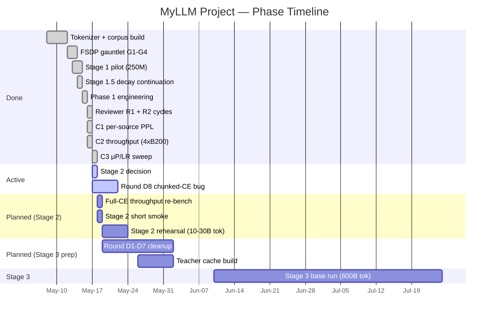

### Per-phase status

| Phase | Goal | Status | Cost spent / projected |
|---|---|---|---|
| **0 — FSDP+canary** | Working FSDP, L2/L3 canaries green | ✅ DONE | ~$300 |
| **1 — Engineering** | Multi-epoch reader, --production, FSDP-safe eval, G6 tests, per-source val loss | ✅ DONE | $0 (CPU) |
| **Pilot (Stage 1)** | 250M, end-to-end pipeline validation | ✅ DONE | $385 |
| **2 — Docs + reviewer** | Reviewer packet, PROJECT_OVERVIEW refresh | ✅ DONE | $0 (CPU) |
| **Round A** | 6 reviewer P1 quick wins | ✅ DONE | $0 (CPU) |
| **Round B** | 4 reviewer P0s for Stage 2 | ✅ DONE | $0 (CPU) |
| **Layer 1** | Backfill reviewer packet with C1 numbers | ✅ DONE | $0 (CPU) |
| **Layer 2 part 1** | MMLU-Pro + GSM8K real adapters | ✅ DONE | $0 (CPU) |
| **C1** | Per-source PPL on pilot | ✅ DONE | ~$8 |
| **C2** | FSDP throughput bench | ✅ DONE @ chunked-CE; ⚠️ needs full-CE re-bench | ~$5 |
| **C3** | μP/LR sweep at 1B | ✅ DONE | ~$30 |
| **Round D8** | chunked-CE NaN-grad investigation | 🔄 Active | $0 (CPU) + small repro budget |
| **Round D9** | Step-718 quarantine investigation | 🔄 Active | $0 (CPU) |
| **3 — Scorecard** | Real benchmark numbers | 🔄 Partial (MMLU-Pro+GSM8K done; IFEval/HE+/MBPP+ pending) | ~$30 + 2 days CPU |
| **4 — Stage 2** | 1B rehearsal at 10-30B tokens | ⏳ Ready (after smoke + decisions) | $350-700 |
| **Round D — Stage 3 prep** | chunked distill, teacher audit, pg19, WSM, logical-axis sharding | ⏳ Parallel with Stage 2 | $0 (CPU mostly) + small GPU |
| **5 — Stage 3** | 1B base run at 600B tokens | ⏳ Blocked on Stage 2 | $11-21K |

---

## 2. System architecture

### High-level flow

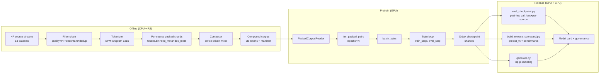

### Module structure

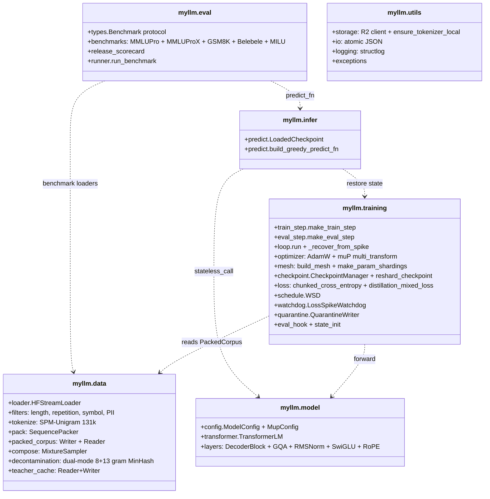

### Tech stack

| Layer | Choice | Why |
|---|---|---|
| Backend framework | Keras 3 + JAX backend | Pythonic, multi-backend, native `jax.sharding` |
| Compute graph | JAX 0.4.38 (pinned) | XLA compilation, deterministic, native multi-device |
| Optimizer | Optax AdamW + multi_transform (muP groups) | Composable, fp32 moments, per-group LR scaling |
| Tokenizer | SentencePiece Unigram 131k + byte fallback | Native SentencePiece (HF tokenizers hits ~15 GB ceiling); wide vocab supports Indic + code |
| Storage | Cloudflare R2 (S3-compat) | Cheap egress; 32-way parallel upload measured 954 Mbps |
| Data | HF `datasets` streaming + custom filters + packer | One stream per source, filter chain, pack to fixed-length sequences |
| Checkpoint | Orbax 0.7.0 (pinned) | Atomic sharded saves; per-step `manifest.json` for partial-write detection |
| Sharding | FSDP/ZeRO-3 via `NamedSharding` | Shipped 2026-05-13, G6 cross-mesh restore proven; G1-G4 gauntlet passes |
| Logging | structlog (JSON events) + W&B | Greppable, machine-parseable; W&B for human dashboarding |
| Tests | pytest, 739 tests across ~47 files | All green; no GPU dep for the core suite |

---

## 3. Data pipeline (build → compose → consume)

### Build path (per-source)

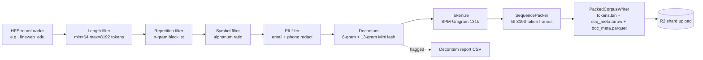

### Source mix (locked for pilot/Stage 2)

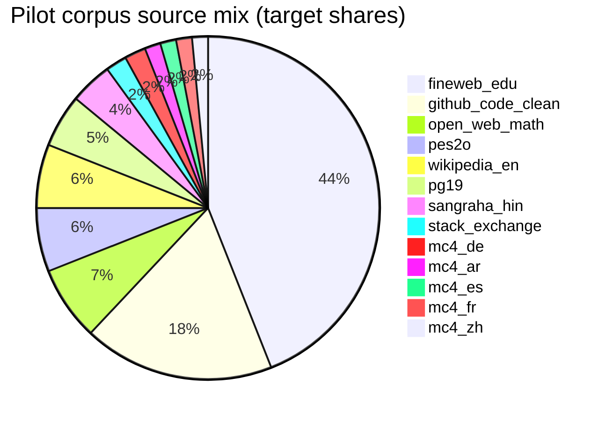

Per-source delivered shares (composed pilot corpus, ~5B tokens):

| Source | Target | Actual | Drift |
|---|---|---|---|
| fineweb_edu | 44.0% | 44.15% | +0.15 |
| github_code_clean | 18.0% | 18.06% | +0.06 |
| open_web_math | 7.0% | 7.02% | +0.02 |
| pes2o | 6.0% | 6.02% | +0.02 |
| wikipedia_20231101_en | 6.0% | 6.02% | +0.02 |
| **pg19** | **5.0%** | **4.67%** | **-0.33** (capped, books finite) |
| sangraha_verified_split_hin | 4.0% | 4.01% | +0.01 |
| stack_exchange_preferences | 2.0% | 2.01% | +0.01 |
| mc4_{de,ar,es,fr,zh} | 1.5-2.0% each | within +0.01 pp | — |

Max drift 0.33 pp, well under the 2% L5 threshold.

### Compose path (multi-source mixer)

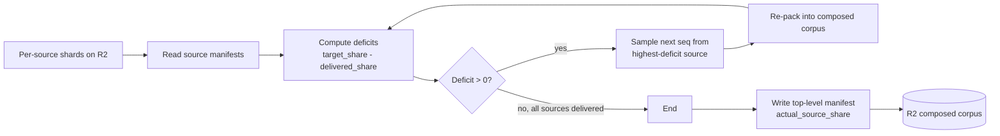

### Consume path (training)

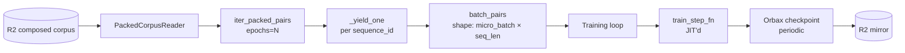

### Decontamination (cross-cutting)

Dual-mode 8-gram + 13-gram MinHash with overlap threshold 0.7. Built from
10 benchmarks (BBH, GSM8K, HumanEval+, IFEval, MATH, MBPP+, MGSM, MMLU-Pro,
MMLU-ProX, Belebele). Index size: ~75 MB (2 indexes × ~37 MB).

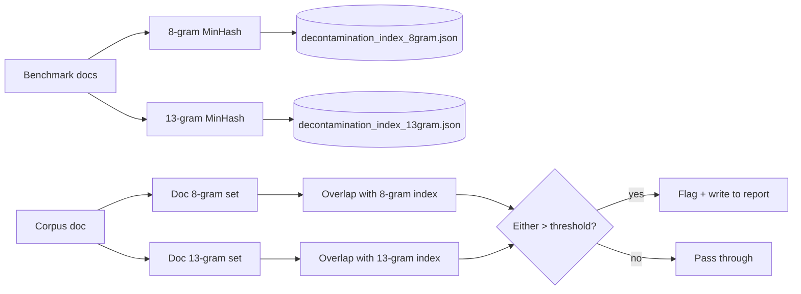

558 docs flagged in the codeparrot/github-code-clean build — verified real
catches, not over-filtering.

---

## 4. Training loop state machine

### High-level state

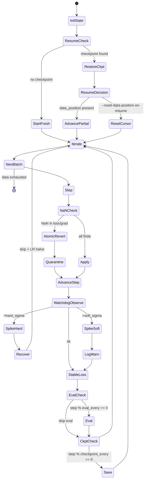

### One step in detail

```mermaid
sequenceDiagram
    autonumber
    participant L as loop
    participant S as state dict
    participant T as train_step_fn (JIT)
    participant W as watchdog
    participant C as checkpoint
    participant Q as quarantine
    L->>S: dpos = state.pop("data_position", 0)
    Note over L,S: state now has 5 keys; in_shardings matches
    L->>T: train_step_fn(state, batch)
    T->>T: forward (model.stateless_call)
    T->>T: backward (jax.value_and_grad)
    T->>T: optimizer.update + apply_updates
    T->>T: jnp.where(step_ok, candidate, old)
    Note over T: atomic NaN revert via where
    T-->>L: (new_state, metrics)
    L->>S: state["data_position"] = int(dpos) + batch_tokens
    L->>W: observe(loss)
    alt hard spike + recoveries left
        W-->>L: "hard"
        L->>C: save spike_marker
        L->>C: restore(rollback_to, template=...)
        L->>L: skip K batches, update data_position
        L->>L: lr_recovery_multiplier *= 0.5
    else soft spike
        W-->>L: "soft"
        L->>L: log warning
    else stable
        W-->>L: "ok"
    end
    alt step % eval_every == 0
        L->>S: edpos = state.pop("data_position", 0)
        L->>L: eval_fn(step, state)
        L->>S: state["data_position"] = int(edpos)
    end
    alt nan_skipped == 1.0
        L->>Q: write batch provenance
    end
    alt step % checkpoint_every == 0
        L->>C: save state + manifest
    end
```

### Why data_position is popped before JIT

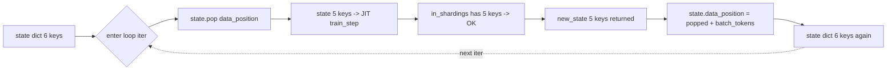

If `data_position` were left in state when entering JIT:
- JAX defaults Python int to int32 → overflow at 2^31 tokens (~step 65,500 at mb=4 seq=8192). Pilot hit this live.
- Under `--fsdp`: in_shardings declares 5 keys (no data_position) but state has 6 → `ValueError: different numbers of pytree children`.

The pop/restore pattern is applied at every JIT boundary: train_step **and** eval_step. See HOTFIX 1 (`cbd5477`) + HOTFIX 2 (`8e50333`).

---

## 5. Sharding + checkpointing

### Mesh topology (4× B200 example)

[`docs/design/diagrams/fsdp_mesh_topology.excalidraw`](design/diagrams/fsdp_mesh_topology.excalidraw)
(open in [excalidraw.com](https://excalidraw.com), export SVG to this dir
when refined)

```
      data axis (size=4)
       ┌──────────────────────┐
       │  GPU0   GPU1         │
       │   ↕      ↕   NV18    │
       │  GPU2   GPU3         │ model axis (size=1)
       │                      │
       └──────────────────────┘

Each leaf with shape [..., D, ...] where D % 4 == 0 is sharded along
that axis. Leaves where no axis is divisible by 4 are replicated.
Scalars (step, lr_recovery_multiplier) are always replicated.
```

For 1B model (hidden=2048, ffn=8192, num_heads=32, vocab=131072):

| Parameter | Shape | Divisibility | Decision |
|---|---|---|---|
| LM embedding (tied) | [V=131072, H=2048] | both / 4 OK | shard along V (largest) |
| Q/K/V projection | [H=2048, num_heads × head_dim=2048] | both / 4 OK | shard along 0-axis |
| FFN gate/up | [H=2048, FFN=8192] | both / 4 OK | shard along FFN (largest) |
| FFN down | [FFN=8192, H=2048] | both / 4 OK | shard along FFN |
| RMSNorm scale | [H=2048] | / 4 OK | shard |
| step (scalar) | () | — | replicate |
| RoPE cos/sin | [seq_max, head_dim/2] | seq_max / 4 OK | shard |

### Save → restore (same mesh)

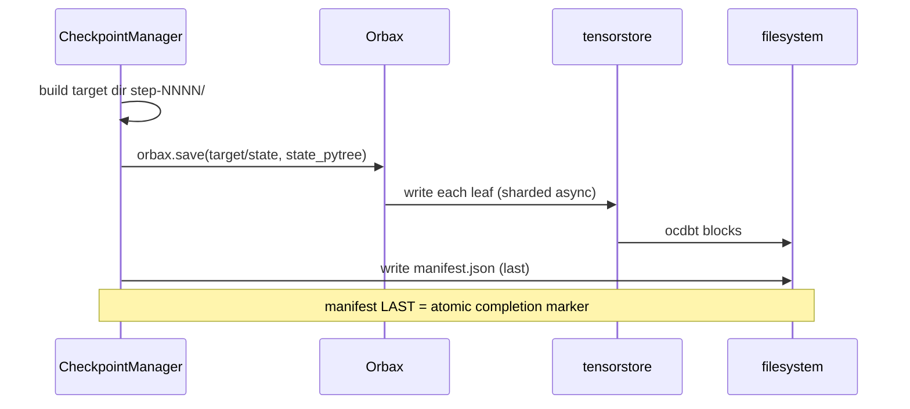

### Restore on same mesh

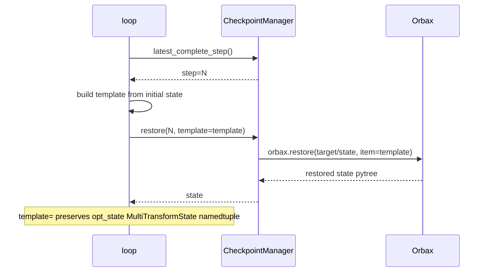

### G6 reshard (cross-mesh, e.g., DP=4 → DP=1 for inference)

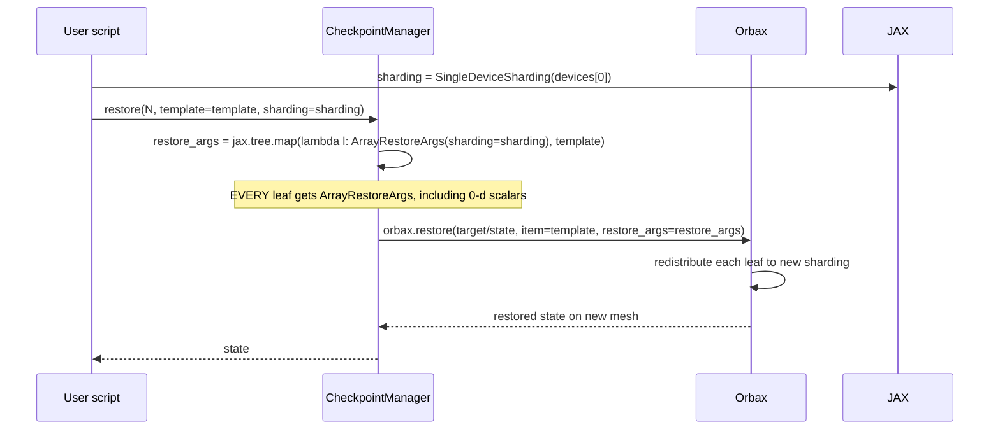

The G6 path was the source of 3 bugs in 2026-05-14 iteration:
1. `shape=` kwarg removed in Orbax 0.7 (commit `13d6126` got it wrong)
2. Bare `RestoreArgs()` rejected for 0-d scalars (commit `3be12de` got it wrong)
3. All leaves need `ArrayRestoreArgs(sharding=...)` (commit `ca1c40b` correct)

All 3 failure modes pinned by `tests/test_checkpoint_reshard.py::TestRestoreWithExplicitSharding`.

### Watchdog recovery state diagram

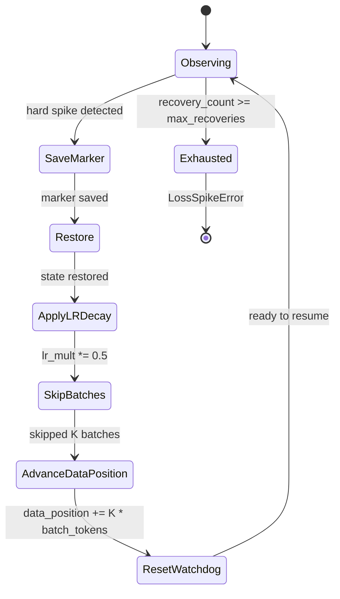

---

## 6. Eval pipeline

Three distinct eval surfaces:

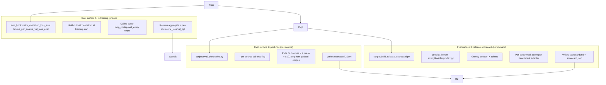

### eval_step internals (forward-only, FSDP-safe)

```mermaid
flowchart LR
    A[state pytree] --> B[Pop data_position]
    B --> C[5-key state to JIT'd eval_step]
    C --> D[model.stateless_call forward]
    D --> E[chunked_or_full_CE return_per_token=True]
    E --> F[metrics: loss + ce + z_loss + nll_per_token + weight_per_token]
    F --> G[Python-side bucketing by source_id]
    G --> H[per-source val_loss accumulator]
    H --> I[Return {val_loss, val_ppl, val_loss/source, val_ppl/source}]
```

Why a separate `make_eval_step` instead of reusing `train_step_fn` under
FSDP:
- `train_step` declares `donate_argnums=(0,)` → input state buffer is
  destroyed in-place after the call. Reusing it for eval would corrupt
  training state.
- `eval_step` declares same `in_shardings` but no `donate_argnums` →
  state remains usable across calls.

### Per-source bucketing

```mermaid
flowchart LR
    A[Held-out batches with source_id arrays] --> B[eval_step returns nll_per_token shape B S]
    B --> C[Python loop over source_vocab]
    C --> D[mask = source_ids == src_int AND weight > 0]
    D --> E[Accumulate nll_sum, weight_sum per source]
    E --> F{All batches done?}
    F -->|no| C
    F -->|yes| G[val_loss/source = nll_sum / weight_sum]
    G --> H[val_ppl/source = exp(val_loss/source)]
```

---

## 7. Algorithms

### 7.1 muP — width-dependent LR transfer

**Goal**: HP found at small width transfers to large width without re-sweeping.

Hidden-weight LR is scaled by `1/width_mult`:

```
W_target = config.hidden_dim
W_base   = config.mup.base_width   (= 256)
width_mult = W_target / W_base

For hidden weights:   effective_lr = peak_lr / width_mult
For embedding/norm:   effective_lr = peak_lr (unscaled)
For LM head:          effective_lr = peak_lr (unscaled)
```

Output multipliers (applied at forward, not via init):

```
attn_output  *= 1 / width_mult
ffn_output   *= 1 / width_mult
lm_head_out  *= 1 / width_mult
```

| Model | hidden_dim | width_mult | Hidden effective LR (peak_lr=3e-4) |
|---|---|---|---|
| Proxy A (wind tunnel) | 384 | 1.5 | 2.0e-4 |
| Proxy B (wind tunnel) | 1024 | 4.0 | 7.5e-5 |
| Pilot 250M | 768 | 3.0 | 1.0e-4 |
| Base 1B | 2048 | 8.0 | 3.75e-5 |

**Status**: C3 sweep confirmed transfer holds 250M → 1B. Pilot's peak_lr=3e-4 wins at 1B.

### 7.2 WSD (Warmup-Stable-Decay) schedule

```
        peak_lr ┤        ┌──────────────────┐
                │       /                    \
                │      /                      \
                │     /                        \
                │    /                          \
                │   /                            \
                │  /                              \
                │ /                                \
                │/                                  \
        end_lr  ┤                                    └──
                └──────────────────────────────────────
                  warmup_steps   stable_steps   decay_steps
```

WSD lets us check-stop at any stable-phase checkpoint and cool it in 10-15% of remaining compute. Doesn't commit to total_steps upfront like cosine does.

Defaults (from `resolve_wsd_schedule_params`):
```
warmup_steps = max(1, min(2000, total_steps // 10))
decay_fraction = 0.15      # last 15% of steps
end_lr_ratio = 0.1         # decay to 10% of peak
```

YAML can override all three.

### 7.3 Chunked CE (memory savings at large vocab)

Avoids materializing `[B, S, V]` logits tensor (8.6 GB at B=8, S=4097, V=131072 in bf16).

**Algorithm** (online logsumexp across chunks):

```
Given:
  hidden_states  H : [B, S, H_dim]
  lm_head_weight W : [V, H_dim]      tied with embedding
  labels         y : [B, S]
  num_chunks     C : vocab split factor (8 by default)
  chunk_size     k = V / C

For chunk c in 0..C-1:
    chunk_logits = H @ W[c*k:(c+1)*k]              [B, S, k]
    chunk_max    = max(chunk_logits, axis=-1)       [B, S]
    new_max      = max(running_max, chunk_max)
    running_sum  = running_sum * exp(running_max - new_max)
                 + sum(exp(chunk_logits - new_max), axis=-1)
    running_max  = new_max
    # Gather label logit IFF labels fall in this chunk
    in_chunk     = (y >= c*k) & (y < (c+1)*k)
    label_logits = where(in_chunk, gather(chunk_logits, y - c*k), label_logits)

log_z = running_max + log(running_sum)              [B, S]
nll   = -(label_logits - log_z)                     [B, S]
```

Peak transient logit memory: `[B, S, V/C]` instead of `[B, S, V]`. At C=8 V=131072: 1.07 GB instead of 8.6 GB.

**KNOWN BUG (Round D8)**: this algorithm produces NaN gradients at 1B + B200 + bf16 + width_mult=8 despite finite forward loss. Suspected: bf16 precision in the online-logsumexp accumulator at vocab=131k seq=8192. Use full-CE on B200 until fixed.

### 7.4 Atomic NaN revert

```
candidate_state = optimizer.update(grads, state) + apply_updates
loss_finite  = jnp.isfinite(loss)
grads_finite = jax.tree.reduce(AND, jax.tree.map(all_isfinite, grads), True)
step_ok      = loss_finite & grads_finite

new_trainable     = jnp.where(step_ok, candidate.trainable,    old.trainable)
new_non_trainable = jnp.where(step_ok, candidate.non_trainable, old.non_trainable)
new_opt_state     = jnp.where(step_ok, candidate.opt_state,     old.opt_state)

# step counter ALWAYS advances (so we don't replay bad batches forever)
new_step = state.step + 1

# nan_skipped exposed as a metric so the loop can log + alarm
metrics.nan_skipped = jnp.where(step_ok, 0.0, 1.0)
```

Why this matters: pre-fix the train_step zeroed gradients but still ran
`optimizer.update`. AdamW's decoupled weight decay applies `lr * wd *
params` regardless of grad → params drifted even on "skipped" batches.

### 7.5 Watchdog spike detection

```
maintain rolling window of recent (loss, step) pairs
mean_loss = mean(window)
std_loss  = stddev(window)

if std_loss < epsilon: return "ok"   # can't compute z-score
z = (loss - mean_loss) / std_loss
if z > hard_sigma: return "hard"     # rollback
if z > soft_sigma: return "soft"     # warn only
return "ok"
```

Defaults: `window=200`, `min_observations=20`, `soft_sigma=3.0`, `hard_sigma=6.0`.

### 7.6 Reduce-scatter vs all-reduce (FSDP P0)

Without `with_sharding_constraint` on grads, XLA emits all-reduce (DP-shaped collective, FSDP-shaped memory — looks like FSDP, costs like DP). The fix:

```python
grads = jax.tree.map(
    lambda g, s: lax.with_sharding_constraint(g, s),
    grads, param_shardings,
)
```

This tells XLA "grads must match param sharding" → only collective that satisfies "all-devices contribute to sharded output" is reduce-scatter. Verified via HLO grep: `reduce_scatter=46 / all_reduce=22` on the gauntlet G2 run.

---

## 8. Phase plan details

### Phase 0 — FSDP gauntlet + canary

| Aspect | Detail |
|---|---|
| Input | Designed FSDP code (commits A-G), 2× H200 SXM pod |
| Process | Run gauntlet G1 (3 train steps, no NaN) → G2 (HLO reduce_scatter > 0) → G3 (loss parity DP vs FSDP atol 5e-3) → G4 (FSDP peak HBM < 20% of DP) → G5 (throughput within 30% of DP) → G6 (save/restore/reshard) |
| Output | HLO inspection report; FSDP enabled in production |
| Gate | All 6 pass |
| Status | ✅ G1-G4 passed 2026-05-13 + G6 fixed 2026-05-14 (3-iteration debug); G5 throughput TBD on full Stage 2 path (chunked-CE bug invalidated C2) |
| Cost | ~$300 |

### Phase 1 — Engineering queue

| # | Item | Commit | Effort | Tests added |
|---|---|---|---|---|
| 1.1 | Multi-epoch corpus reader | `be7574c` | 4 hr | 8 |
| 1.3+1.4 | --production + strict resume safety | `082fa20` | 4 hr | 5 |
| 1.5 | Forward-only `make_eval_step` | `107a551` | 6 hr | 7 |
| 1.6 | G6 cross-mesh restore regression coverage | `97c59c1` | 2 hr | 6 |
| 1.2 | Per-source val loss via per-token NLL | `fbe9c72` | 6 hr | 14 |

### Pilot (Stage 1 + 1.5)

| Aspect | Detail |
|---|---|
| Hardware | 4× H200 SXM (RunPod), DP-replicated NOT FSDP |
| Model | 250M (16 layers, hidden 768, GQA 3:1, RoPE base 130k, SwiGLU, QK-norm, tied embeddings) |
| Training | Stage 1 stable phase (single-pass corpus exhausted at step 151,990); Stage 1.5 decay-only continuation (20K steps, LR linear 3e-4 → 3e-5) |
| Watchdog | 288 NaN-skips / 172K steps (1.9 / 1K), 0 hard rollbacks |
| Final val_loss / val_ppl | 2.7303 / 15.34 (Stage 1.5) |
| Cost | $385 |
| Status | ✅ DONE |

### Phase 2 — Docs + reviewer cycle

Two reviewer rounds processed code-side: Round A (6 quick wins) + Round B (4 Stage-2 gating P0s) + Layer 1 (packet backfill) + Layer 2 part 1 (real benchmark adapters) + state_init refactor + 2 hotfixes for `data_position` under FSDP. See commit table in §1.

### Phase 3 — Release scorecard

| Aspect | Detail |
|---|---|
| Goal | Real benchmark numbers (MMLU-Pro, GSM8K, HumanEval+, MBPP+, IFEval, BBH, MATH, MGSM, MMLU-ProX, Belebele) |
| Status | Partial. MMLU-Pro + GSM8K adapters shipped (`04bfaf5`). IFEval / HumanEval+ / MBPP+ pending (need sandboxed code-exec + constraint library). |
| Pending effort | ~3-4 hr per remaining benchmark × 3 = ~10-12 hr CPU |
| GPU cost | ~$30 once predict_fn + adapters complete (1× H100 PCIe re-run on pilot checkpoint) |

### Phase 4 — Stage 2 rehearsal

| Aspect | Detail |
|---|---|
| Goal | 1B at 10-30B tokens, validate the recipe at production scale |
| Hardware | 4× B200 NVLink-5 OR 8× B200 OR 8× H200 SXM (pending decision) |
| Sequence length | 8192 (corpus is at 8K) |
| Batch | `--micro-batch-override 4` locked (full-CE needs the memory) |
| Loss | full-CE (chunked-CE bug, D8) |
| LR | peak_lr=3.0e-4 (locked by C3) |
| Token budget | 10B / 20B / 30B (pending decision) |
| Cost | $350 (10B on 4×B200) to $2K (30B on 8×H200) |
| Pre-req | Short smoke (~2K steps, ~$15) to confirm full-CE throughput at 1B shape |
| Gate | Finite loss throughout; nan_skipped < 0.1%; val_loss descending; eval suite runs; no LossSpikeError |
| Status | ⏳ Ready after smoke + decision |

### Phase 5 — Stage 3 base run

| Aspect | Detail |
|---|---|
| Goal | 1B at 600B tokens (Chinchilla-overtrained for inference), with distillation decay phase |
| Hardware | 8× H200 SXM or 8× B200 (depends on availability + economics) |
| Token budget | 600B (floor 300B, target 600B, ceiling 1T) |
| Teachers | DeepSeek-V4-Pro-Base + Olmo-3-32B-Base (license + vocab compatibility resolved) |
| Distill activation | Decay phase only (`distill_alpha=0.3` mixed with CE) |
| Cost | $11-21K |
| Adaptive stop rule | At 300B floor; at 400B if gain < 1.5%/50B × 2 intervals → STOP; at 600B if last 100B gain ≥ 3% → continue toward 1T |
| Status | ⏳ Blocked on Stage 2 + Round D distillation prep |

### Round D — Stage 3 prep (parallel with Stage 2)

| # | Item | Effort | Why |
|---|---|---|---|
| D1 | Chunked distillation in decay phase | 1-2 days | Without this, decay-phase materializes [B, S, V] for KL → OOM at 1B+ |
| D2 | Teacher top-K mass audit on real text | 0.5 day + GPU | The audit machinery's K=32 recommendation was based on synthetic random tokens, not real |
| D3 | Stratified per-source held-out | 4 hr | Current held-out is head-of-corpus; biases per-source numbers |
| D4 | pg19 replacement for Stage 3 | depends | pg19 finite (-0.33pp drift at 5B); at 600B would be drastically under-represented |
| D5 | Stack Exchange `question + chosen_response` | 2 hr | Current loader uses question-only (wastes the answer) |
| D6 | Real scoring policies for IFEval/HE+/MBPP+ | 1-2 days | Layer 2 only did MMLU-Pro + GSM8K |
| D7 | Logical-axis FSDP sharding rules | 2-3 days | Replace shape-heuristic with named-axis-role rules (more predictable mesh behavior) |
| **D8 (NEW)** | **chunked-CE NaN-grad at 1B+B200+bf16** | 1-2 days CPU + GPU repro | Investigate online logsumexp accumulator precision at this scale |
| **D9** | ~~step-718 deterministic bad batch~~ — **DONE** 2026-05-17 | 1 hr CPU | Root cause: Stack Exchange single-doc 8K sequence at shard 0 / seq_id 2871. Folds into Round D5. See [`design/d9_step718_investigation.md`](design/d9_step718_investigation.md). |

---

## 9. Open decisions

### Stage 2 launch parameters

| Decision | Option A | Option B | Option C |
|---|---|---|---|
| Hardware | 4× B200 NVLink-5 | 8× B200 NVLink-5 | 8× H200 SXM |
| Per-hr cost | ~$14 | ~$28 | ~$25 |
| Aggregate compute (BF16 TFLOPS) | 4400 | 8800 | 7920 |
| Wall time for 30B tokens | ~38 hr | ~19 hr | ~21 hr |
| Total cost for 30B | $530 | $530 | $525 |
| Stage 2 risk if hardware turns flaky | Already proven on 4× B200 | Re-verify FSDP at 8× mesh | Re-verify FSDP at 8× H200 |

| Decision | Option A | Option B |
|---|---|---|
| Seq length | 4096 | 8192 |
| MFU @ 4× B200 chunked-CE | 46% (from C2) | 30% (from C2) |
| Recipe consistency with pilot | broken | preserved |
| Stage 2 cost @ 30B | $350 | $530 |

| Decision | Option A (10B) | Option B (20B) | Option C (30B) |
|---|---|---|---|
| Wall time @ 4×B200 | ~13 hr | ~25 hr | ~38 hr |
| Cost | $180 | $350 | $530 |
| Signal strength | "does it train?" | "is it stable?" | "is the recipe right at base scale?" |
| Recommendation | smoke probe only | low-confidence Stage 2 | full-confidence Stage 2 |

### Decision tree

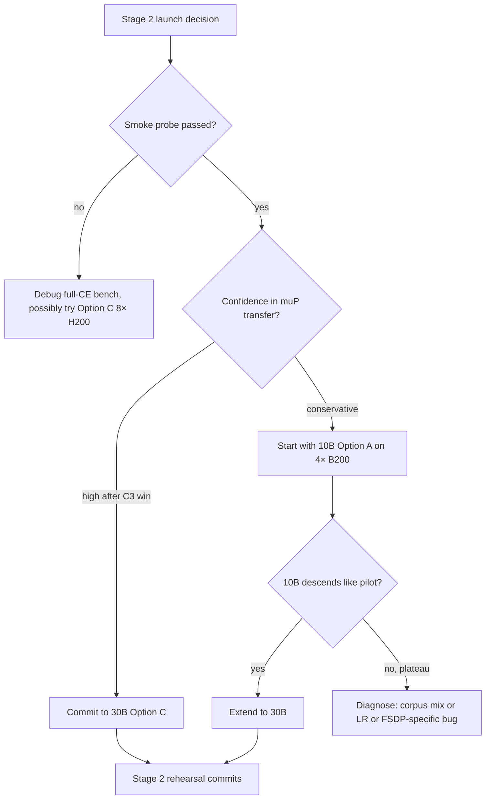

---

## 10. Hardware comparison + cost model

### Per-hardware compute + interconnect

| Hardware | Per-GPU BF16 TFLOPS | Per-GPU HBM | Interconnect | Pre-pinned tested |
|---|---|---|---|---|
| H200 SXM | 989 | 141 GB HBM3e | NVLink-4 + NVSwitch (900 GB/s) | ✅ pilot DP-replicated; ✅ FSDP gauntlet 2× H200 |
| B200 SXM | ~1100 | 183 GB HBM3e | NVLink-5 (1.8 TB/s pair-wise) | ✅ C2 + C3 (4× and confirmed by NV18 topology) |
| H100 PCIe | 989 | 80 GB HBM3 | PCIe-5 (~64 GB/s) | ⚠️ pilot post-hoc eval; FSDP unproven |
| RTX Pro 6000 Blackwell | ~250 | 96 GB GDDR7 | PCIe-5 (~64 GB/s) | ❌ not tested for training |

### Stage 2 cost model (30B tokens, full-CE on B200)

| Configuration | $/hr | Aggregate tok/s | Wall (30B) | Total $ |
|---|---|---|---|---|
| 4× B200 NVLink-5 | ~$14 | ~220K (chunked-CE C2; full-CE TBD, prob ~70% = ~155K) | ~54 hr | ~$760 |
| 8× B200 NVLink-5 | ~$28 | ~440K projected (linear scale; less for FSDP overhead) | ~27 hr | ~$760 |
| 8× H200 SXM | ~$25 | ~330K (pilot 4× H200 DP-replicated was ~110K) | ~25 hr | ~$625 |

Numbers assume Stage 2 runs at full-CE mb=4 (until D8 fixes chunked-CE). After D8 (chunked-CE works on B200), throughput on B200 should jump to the C2 numbers (~220K → 350K+ aggregate). Major cost-model improvement post-D8.

### Stage 3 cost model (600B tokens, post-D8)

| Configuration | $/hr | Aggregate tok/s (chunked-CE) | Wall | Total $ |
|---|---|---|---|---|
| 8× B200 NVLink-5 + chunked-CE | ~$28 | ~440K | ~380 hr (16 days) | ~$11K |
| 8× H200 SXM + chunked-CE | ~$25 | ~330K | ~505 hr (21 days) | ~$13K |
| 16× B200 (if available) | ~$56 | ~700-800K | ~210 hr (9 days) | ~$12K |

Adaptive stop rule kicks in at 300B floor (~$5.5K spent) before any further commitment.

---

## Appendix A — Where things live (file pointers)

See [SESSION_HANDOFF §6](SESSION_HANDOFF.md#6-where-things-live) for the canonical file-pointer table. Highlights:

- **`pilots/250m_v1/`** — frozen pilot artifacts (configs, results, R2 paths, command log)
- **`docs/PROJECT_OVERVIEW.md`** — canonical state (refreshed periodically)
- **`docs/review/POST_PILOT_REVIEW_2026-05-15.md`** — reviewer packet
- **`docs/SESSION_HANDOFF.md`** — live handoff for next session
- **`src/myllm/training/state_init.py`** — model+optimizer+state construction (recently refactored from scripts/)
- **`src/myllm/infer/predict.py`** — shared checkpoint load + greedy decode
- **`src/myllm/eval/benchmarks/`** — real benchmark adapters

## Appendix B — Excalidraw source files

Located at `docs/design/diagrams/`:

| File | Purpose | Status |
|---|---|---|
| `fsdp_mesh_topology.excalidraw` | 4-GPU NVLink-5 mesh with sharded parameter layout | Skeleton (open in excalidraw.com to refine) |
| (more to come as needed) | | |

To open: drag-drop the `.excalidraw` file into [excalidraw.com](https://excalidraw.com) (or use the VSCode plugin). Export to SVG, place next to the `.excalidraw` source, and embed in MD via ``.

---

## Appendix C — How to evolve this doc

- **For a new algorithm/component**: add a §7.x with the math + a Mermaid diagram + status
- **For a new phase**: add a row to §1's per-phase table + a §8 detail block
- **For a new bug**: add to §0's "active bugs" list + a §3-style state diagram of the failure mode + an §8 Round D entry
- **For a new decision**: add to §9 with options table + decision tree

When the doc grows past ~2000 lines or becomes hard to read end-to-end, split per topic into `docs/design/0X_<topic>.md` and keep this file as the index.
