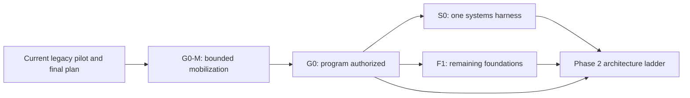
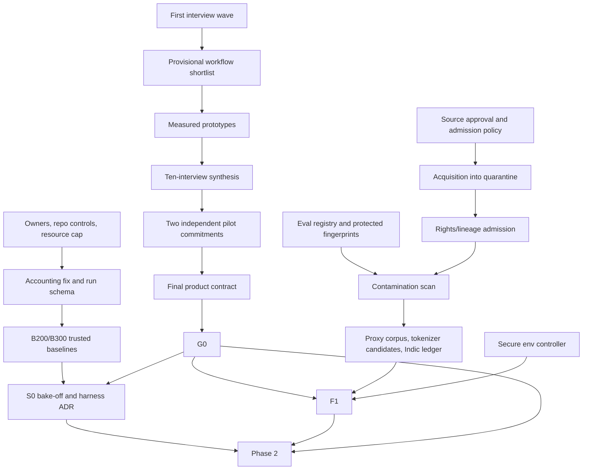

# SAMA-7B — Phase 1 G0/S0/F1 Execution Plan

**Version:** 1.0-draft  
**Prepared:** 2026-07-23  
**Planning window:** staffed earliest case 2026-07-23 through 2026-09-17; staffed-case evidence
backstop 2026-10-15; base/lean dates are capacity-driven per §5.3  
**Status:** Proposed for owner approval; no work is authorized by this draft alone  
**Parent authority:** [FINAL_PROGRAM_PLAN.md](FINAL_PROGRAM_PLAN.md)  
**Source reviewed, not modified:** [PHASE_1_PLAN.md](PHASE_1_PLAN.md)  
**Tracker:** Linear project “SAMA-7B Program”; this document proposes tracker changes but does not apply them

**Authority note:** This draft proposes four explicit amendments to the parent plan: completed
10/3/2 product evidence at G0, a separate F1 gate, no Phase-2 experiment-rung work before
G0+S0+F1, and deferral of full allocated-cluster loss parity from S0 to the 7B-rehearsal
authorization gate. The parent plan remains authoritative until the owner signs the corresponding ADR.

---

## 1. Executive decision

Phase 1 will build the trustworthy operating system for the SAMA-7B program. It will not train
the product model or select the final model architecture. Its job is to prove that the company
has a real product wedge, accountable people, lawful and traceable inputs, trustworthy
measurement, a production training harness, and a minimal verified-agent foundation before
larger experiments begin.

The prior draft placed product, data, tokenizer, evaluation, environment, and systems outcomes
inside one S0 checklist. That makes the decision ambiguous: a good training harness could fail
because an unrelated tokenizer task slipped, or Phase 2 could start after a systems pass while
the data and evaluation foundations remained unsafe. This execution plan separates four
decisions:

| Decision | Earliest target | Question answered | What it authorizes |
|---|---:|---|---|
| **G0-M — Mobilization** | Day 3–5 | May bounded setup and discovery begin? | Capped outreach, hiring, counsel, repo setup, audit work, and small diagnostic runs |
| **G0 — Program authorization** | 2026-08-20 | Is there sufficient product, people, budget, governance, and measurement evidence to fund the program? | The bounded S0 campaign and completion of Phase 1 foundations |
| **S0 — Systems selection** | 2026-09-17 earliest | Which single training harness is technically qualified? | One production harness; the other becomes reference-only |
| **F1 — Foundation complete** | 2026-09-17 earliest; 2026-10-15 staffed-case backstop | Are the data, tokenizer, evaluation, environment, and operating foundations ready? | Entry to Phase 2, but only when G0 and S0 have also passed |

**Recommended amendment: Phase 2 may not start until G0, S0, and F1 all pass.** Preparatory code
or diagnostic runs performed under G0-M or G0 do not count as Phase-2 experiment-rung evidence.
This changes the parent plan's week-5 overlap and therefore requires an owner-signed amendment.
If the owner rejects the amendment, the overlap must still be limited to reversible preparation
that cannot produce an architecture decision or promotion claim.

Dates are targets, not reasons to lower criteria. If evidence is incomplete, the gate moves.

---

## 2. Phase boundary

### 2.1 Outcomes required by the end of Phase 1

1. A signed product contract based on ten completed interviews, three measured prototypes, and
   two written pilot commitments supporting one coherent primary workflow.
2. A realistic staffing and resource plan with named human owners for every critical workstream.
3. A fresh private PyTorch program lineage with protected CI, signed ancestry, dependency and
   AI-use records, and a documented boundary from the legacy JAX/Keras pilot.
4. Correct token, throughput, and cost accounting, plus reproducible B200 and B300 baselines.
5. A real, versioned, fail-closed evaluation contract whose complete surface feeds
   decontamination before corpus processing.
6. One selected production training harness that passes BF16, MXFP8, context-parallel,
   checkpoint, recovery, export, and serving gates.
7. A corpus-admission and signed-ledger golden path, three tokenizer candidates, and an Indic
   evidence ledger. No tokenizer is frozen in this phase.
8. A thin secure agent-environment controller with five representative adapters and verified
   trajectory production—not a production-scale environment fleet.
9. A reviewed and pre-registered Phase-2 experiment packet with budgets, metrics, seeds,
   promotion rules, and stop conditions fixed before results are seen.

### 2.2 Explicit non-goals

Phase 1 does **not** include:

- training the 7B base model or beginning the 6T run;
- selecting or freezing the final architecture, optimizer, data mixture, or tokenizer;
- running the 350M factorial or 1–1.3B finalist program as decision evidence;
- mass mirroring or tokenizing a multi-trillion-token corpus;
- customer-data training, production credentials, or actions against live customer systems;
- RL, RLVR, preference tuning, or production-scale synthetic trajectory generation;
- 512K context work or a public 262K quality claim;
- public model announcements, disclosures of candidate inventions, or unreviewed product claims;
- maintaining two production training stacks after S0.

### 2.3 Operating principles

- **Evidence beats schedule.** A date can move; a gate criterion cannot be silently weakened.
- **Humans own decisions.** AI tools may draft, analyze, test, and automate, but they cannot be
  accountable owners, signatories, legal reviewers, budget approvers, customer witnesses, or
  independent validators.
- **One claim, one artifact.** Every important claim links to a versioned artifact, immutable
  run, reviewer, and decision record.
- **No rights-by-label shortcuts.** Dataset-level terms such as ODC-BY or CC0 do not by
  themselves clear every contained artifact or the act of acquiring and processing it.
- **No data ahead of controls.** Source approval precedes acquisition; the evaluation registry
  and decontamination export precede corpus tokenization.
- **Measured quantities are primary.** Step time, actual processed tokens, loss-bearing tokens,
  memory, and communication are primary. MFU is secondary and must use a versioned FLOP model.
- **Private IP has a real access boundary.** Restricted invention, customer, and legal material
  lives in a separate vault or restricted repository—not merely a folder in the engineering repo.
- **Smallest valid proof first.** CPU reference, GPU proxy, then full-width feasibility. Large
  hardware is not a substitute for a precise experiment.

---

## 3. Starting-point audit

The following facts are the Phase 1 baseline and must be reflected in the first gate packet:

| Area | Current state | Phase 1 implication |
|---|---|---|
| Repository | Current head is `00a825f`; no tags were found | Freeze the exact legacy state before audit edits |
| Runtime | Existing implementation is JAX/Keras/Orbax | Do not seed the new PyTorch training lineage from the old runtime |
| Controls | No root `AGENTS.md`, `.github/` CI, pre-commit setup, or protected program scaffold is present | Create a fresh private program repository and CI baseline |
| Plans | The new program plans and research tree are currently untracked | Securely version approved plans; do not leave program authority in untracked files |
| Linear | Sixteen issues are in Backlog; only HAR-5 is assigned and only HAR-12 is due-dated | The current board is not yet an executable delivery system |
| Staffing | One human workspace member is visible | Eight weeks is not credible for the full scope without immediate staffing or contractors |
| Accounting | The legacy benchmark multiplies a global batch by device count after sharding | Multi-GPU TPS, per-GPU TPS, MFU, and derived economics require an errata and recomputation |
| Evaluation | HumanEval+/MBPP+ placeholder scoring accepts non-empty output; required failures can still exit successfully | Reuse only validated adapters/schema ideas; no current scorecard can support a gate |
| Long context | The parent program requires native 262,144 combined tokens | Phase 1 proves systems feasibility, not 262K product quality or certification |
| Cluster | B200 and B300 resources exist, but exact topology, scheduler, reservations, and operating owner are not in the plan | Inventory and reserve exact nodes before G0/S0 experiments |

The accounting defect is material. The existing data path creates one global `[batch, sequence]`
tensor and shards it, while the throughput report multiplies the configured batch by world size
again. Historical `data_position` is the trustworthy token cursor. Raw historical logs must
remain immutable; a versioned errata must map every affected run to the corrected calculation or
withdraw the number when reconstruction is impossible.

---

## 4. Authorization model



### 4.1 G0-M — bounded mobilization

G0-M is an owner-signed control decision—not a new program milestone and not a claim that the
program has passed G0. It exists so the team can obtain the evidence needed for G0 without
informally authorizing the whole program.

Recommended G0-M cap until G0 passes:

- at most 600 GPU-hours of G0-specific diagnostics, hardware qualification, provisional
  baselines, and prototype/evaluation inference;
- at most 20 TB of approved staging/quarantine storage;
- at most USD 25,000 of counsel, research, QA, and tooling spend; contract engineering is a
  separate named-person authorization;
- no mass corpus acquisition, architecture campaign, public disclosure, or customer-data use.

The owner may choose different caps, but the signed decision must state them explicitly.

### 4.2 G0 — program authorization

G0 is a business, product, people, governance, and technical-integrity gate. It does not select
the model architecture or systems winner. It answers whether there is enough coherent evidence
and controlled capacity to proceed.

The recommendation is to make **10 interviews, 3 measured prototypes, and 2 written pilot
commitments** hard G0 evidence. This is stricter than the parent timeline's wording that the
product contract is “started” at G0, so it must be accepted as a signed amendment. The earlier
draft reduced this to five interviews and delayed a second letter; that trades away the principal
evidence the gate is meant to obtain. If the evidence is not complete by August 20, G0 should move.

### 4.3 S0 — systems-only selection

S0 selects Megatron Bridge or TorchTitan as the single production training harness. Tokenizer,
Indic, corpus, baseline-model, and environment tasks are not S0 blockers. They are reviewed at
F1. Muon is an optional decision input, not an automatic S0 rejection criterion.

### 4.4 F1 — foundation-completeness gate

F1 closes the remaining Phase 1 foundations: data controls, tokenizer candidates, evaluation
assets, thin agent environments, Phase-2 pre-registration, and operating readiness. S0 and F1
may be reviewed on the same date but must record separate decisions.

---

## 5. People, accountability, and capacity

### 5.1 Required human roles

One person may temporarily hold several roles, but every role must name a human and disclose the
capacity risk. “AI” or a tool name is never a Responsible or Accountable party.

| Code | Role | Core responsibility |
|---|---|---|
| **FO** | Founder / program owner | Program scope, capital, final gate decisions, commercial risk |
| **PO** | Product and program lead | Design partners, product contract, schedule, evidence packet |
| **ST** | ML systems lead | Distributed training, S0, accounting, performance, checkpoints |
| **DL** | Data and governance lead | Admission, lineage, removal, decontamination, tokenizer inputs |
| **EA** | Evaluation, safety, and agent-environment lead | Eval contract, private suites, sandboxes, verified actions |
| **IS** | Infrastructure and security owner | Cluster, secrets, CI runners, storage, incident controls |
| **FP** | Finance and people-operations owner | Budget, hiring process, contracts, resource accounting |
| **LC** | Qualified external counsel | Data, privacy, IP, trademark, release-term review |
| **IR** | Independent technical reviewer | Gate-critical arithmetic, reproducibility, parity, and evidence review |
| **CR** | Independent customer-evidence reviewer | Interview quality, scoring consistency, prototype relevance, and pilot evidence |
| **LR** | Language reviewers | Native review for each Indic language included in a claim |

The operating roster records, for each role, the human name, start date, weekly allocation,
backup, and any conflict of interest. A vacant Responsible role means the corresponding work
package remains in Backlog. IR and CR must not author the evidence they validate.

### 5.2 RACI for gate-critical outcomes

| Outcome | Accountable | Responsible | Consulted / validator |
|---|---|---|---|
| Phase charter, budget, and resource cap | FO | PO, FP | ST, DL, IS, LC |
| Product contract and pilot evidence | FO | PO | Design partners, CR, FP |
| Legal, corpus, privacy, and IP controls | FO | DL | LC records legal conclusions; IS validates controls |
| Private repo, lineage, CI, and secrets | ST | IS, ST | DL, IR |
| Accounting correction and baselines | ST | ST | IR validates |
| Eval contract and private-suite v0 | EA | EA | DL, IR, LR |
| S0 campaign and harness ADR | FO | ST | IR, IS |
| Data/tokenizer foundation | DL | DL | EA, LC, LR |
| Agent environment foundation | EA | EA | IS, ST, security reviewer |
| Gate evidence packet | FO | PO | All workstream owners and IR |

### 5.3 Capacity rule

The full scope is approximately **43–63 human person-weeks plus counsel**. It is credible in eight
weeks only with roughly 6–8 FTE-equivalents. Four to six named contributors can reach the core
gates only with focused contractors and deferred stretch work.

Earliest-case weekly allocation:

| Capacity | G0 window | S0/F1 window |
|---|---:|---:|
| FO | 0.4 FTE | 0.3 FTE |
| PO | 1.0 FTE | 0.5 FTE |
| Prototype/product engineer | 1.0 FTE | 0.25 FTE |
| ST | 1.0 FTE | 1.0 FTE |
| Additional systems engineers | 0.5 FTE | 1.0–2.0 FTE |
| DL | 0.75 FTE | 1.0 FTE |
| EA | 0.75 FTE | 1.0 FTE |
| IS | 0.5 FTE | 0.5 FTE |
| FP, LC, IR, CR, LR combined | 0.5–1.0 FTE equivalent | 0.5–1.0 FTE equivalent |

Forecast by available capacity:

| Scenario | G0 forecast | S0 and F1 forecast | Interpretation |
|---|---|---|---|
| **Staffed** — 6–8 FTE-equivalent | 4 weeks | G0 + 4–6 weeks | September 17 is possible |
| **Base** — 3–4 active contributors plus specialists | 6–9 weeks | G0 + 6–8 weeks | Approximately 12–17 weeks total |
| **Lean** — 2 active contributors plus counsel/review | 10–16 weeks | G0 + 12–20 weeks | Approximately 22–36 weeks total |
| **Single human** | Not schedule-credible for full scope | Roughly 9–15 months or material scope reduction | AI assistance does not replace independent roles |

At any capacity, run no more than two major packages per human and move dates instead of
reclassifying incomplete evidence as done.

**Reforecast trigger:** if PO, ST, DL, EA, or IS is not named with the allocation needed by
2026-07-30, September 17 becomes an earliest-case date only and a revised critical-path forecast
is required.

### 5.4 Definition of Ready

An issue may enter `Todo` only when it has:

- one accountable human and one responsible human;
- workstream, gate, priority, estimate, target date, and dependencies;
- one concrete artifact or decision outcome;
- quantitative acceptance criteria fixed before execution;
- compute, storage, credential, data, security, and license needs identified;
- an evidence location and reviewer identified;
- scope small enough for about five working days, or it is split;
- no privileged legal, customer, candidate, or invention content copied into Linear.

### 5.5 Definition of Done

“Done” means all of the following, not merely code merged:

- acceptance tests pass and failures/negative results are retained;
- the artifact is at a pinned commit or immutable object/run ID;
- code, config, container, dependency, data, tokenizer, prompt, and scorer hashes are recorded as
  applicable;
- another qualified person reproduces or reviews the result from a clean environment;
- license, ancestry, security, privacy, and removal metadata are complete;
- residual risks and exceptions are recorded with owners and expiry dates;
- the gate manifest and Linear issue link to the evidence;
- the accountable human accepts the result.

---

## 6. Work breakdown structure

### P1-00 — Program controls and G0-M

**Accountable:** FO  
**Responsible:** PO, FP  
**Gate:** G0-M and all later gates  
**Core effort:** 3–5 person-days to start, then 0.5–1 person-day per week

Required outputs:

1. Phase charter with confirmed, conditional, deferred, and rejected decisions. The parent
   heading “ALL RESOLVED” must not hide items still subject to owner confirmation or evidence.
2. Signed G0-M activity, GPU, storage, and external-spend caps.
3. Named interim RACI, hiring/contractor plan, and escalation contacts.
4. Program risk register, decision log, exception log, and evidence-manifest schema.
5. One production-training scheduler decision. Recommended default: use the cluster’s proven
   Slurm path for tightly coupled training and Kubernetes for agent environments; do not build
   two production schedulers unless the infrastructure audit proves this recommendation wrong.
6. Weekly operating cadence and WIP limits.

Acceptance:

- every mandatory work package has a human owner and capacity allocation;
- every gate has a reviewer and meeting date;
- red risks have a mitigation or explicit stop condition;
- G0-M caps are machine-readable in the budget ledger;
- the board reflects dependencies, not just a list of broad backlog items.

### P1-10 — Product wedge and design-partner proof

**Accountable:** FO  
**Responsible:** PO  
**Gate:** G0  
**Core effort:** 8–12 person-weeks including interviews and prototypes

#### P1-11 Interview funnel

Build a funnel of approximately 20–25 qualified prospects, schedule 12–15, and complete at least
10 structured interviews. The interviews must test the need rather than sell the existing thesis.
They must represent at least eight distinct organizations, with at least six interviews in the
eventually selected primary ICP. A provisional ICP may guide recruiting, but if selection changes,
additional interviews are required before G0. Across the set, cover workflow operators, economic
buyers/sponsors, and IT/security/procurement stakeholders: at least four operator perspectives, three buyer/sponsor
perspectives, and three IT/security/procurement perspectives. One multi-stakeholder session still
counts as one interview, while each represented role is recorded for coverage.

Required fields:

- workflow start state, end state, frequency, volume, human time, error cost, and failure impact;
- actual document/repository/context-size distribution, including p50/p95 and maximum where the
  partner can provide it;
- languages and code-switching used in the work;
- tools, systems, permissions, approvals, audit, rollback, and evidence requirements;
- current human/model baseline and why it fails;
- on-prem, VPC, residency, security, and procurement constraints;
- target **serving** hardware, concurrency, latency, and budget—not the company’s training GPUs;
- pilot willingness, technical owner, authorized test-data availability, and commercial path.

An interview counts as complete only when the required fields, source role, evidence/confidence,
disconfirming observations, and follow-up actions are recorded and the participant has confirmed
that the described workflow is real. Retain negative evidence. “Sanitized” partner data is not
automatically authorized: default to synthetic/open fixtures, and require written use terms,
isolation, retention/deletion controls, and provider-term review before any partner data or API
model sees it.

Evidence sequence:

```text
first interview wave (at least five)
→ provisional workflow shortlist
→ discovery-led prototypes
→ ten-interview synthesis and final workflow selection
→ two independent commitments for that workflow family
→ final product contract
```

#### P1-12 Workflow selection score

| Dimension | Weight |
|---|---:|
| Pain and measurable economic value | 20 |
| Frequency and repeatability | 10 |
| Need for verified agentic execution | 10 |
| Need for naturally coherent long context | 10 |
| Need for Indic/code-switch capability | 5 |
| Verifiability and safe rollback | 10 |
| Sovereignty / on-prem need | 10 |
| Data and integration readiness | 5 |
| Sponsor and procurement path | 10 |
| Plausible serving economics | 10 |

Score each dimension from 0 to 5: 0 = contradicted/no evidence, 1 = assertion only, 2 = occasional
or weak evidence, 3 = repeated and measurable evidence, 4 = quantified need plus a capable
sponsor/data path, and 5 = contractual or paid evidence with a usable baseline. Calculate
`sum(weight × score / 5)`. Unknowns score zero for selection and remain visible. PO scores first;
CR independently reviews every shortlisted workflow, the evidence citations, and disagreements.

Select one primary workflow only if it scores at least 70/100, has no fatal legal or safety
dependency, exposes a defensible capability/economic gap after the build-vs-buy comparison, and
both pilot commitments support the same job-to-be-done/workflow family. A secondary workflow may
remain, but Phase 2 optimizes for the primary one. Pain/economic value, sponsor/procurement, and
serving economics must each score at least 3/5; a high total cannot hide a zero in commercial
viability. At G0-M the owner freezes a value-to-cost hurdle—initial recommendation: expected
customer value at target volume is at least 3× fully loaded inference, deployment, and support
cost in the base case, with low/base/high sensitivity and partner-validated assumptions.

Claims are decided separately:

- retain the agentic claim only with a score of at least 3/5 for agentic need and verifiability;
- retain the long-context product rationale only when naturally occurring coherent inputs and
  measured value support it; padded or concatenated prompts do not count. Pre-register a test at
  G0-M—initial recommendation: at least 20 partner-attested tasks across two organizations, with
  coherent inputs materially beyond 128K and coverage near 200K+, where the long-context method
  produces at least a 10-point absolute task-success/evidence gain or a 20% relative error
  reduction versus the best retrieval/context-compilation baseline inside the approved economics;
- retain on-prem/sovereignty language only with a score of at least 3/5;
- retain an Indic-language claim only for a language with customer and native-review evidence;
  Hindi/Hinglish evidence does not validate Bengali, Tamil, Telugu, or Marathi.

An unsupported supporting claim triggers a parent-plan amendment and narrower positioning. A
failed core workflow/build case triggers Pivot; the team must not force the original compound
wedge through an average score.

#### P1-13 Three measured prototypes

Prototype selection follows the first interview wave; it does not pre-commit the product to three
demo ideas. Use existing models and synthetic, authorized, or openly licensed artifacts. The
three required prototype roles are:

1. **Primary-workflow prototype:** an end-to-end version of the leading partner-backed workflow.
2. **Riskiest-differentiator prototype:** directly test the hardest claimed advantage—naturally
   long context, a named Indic language, verified automation, or on-prem economics.
3. **Safety and alternative-solution prototype:** test authorization/state-delta/rollback where
   actions exist and compare whether retrieval, workflow software, or a stronger existing model
   solves the job without building SAMA.

Candidate implementations include whole-repository work, Hindi/Hinglish operational documents,
and sandboxed terminal automation, but only prototypes supported by partner evidence count at G0.
No production credentials or live financial/government actions are permitted.

Every prototype must ship a reproducible task pack, pinned baseline, at least three repeated
runs where stochasticity matters, raw traces, failure log, serving-cost observation, design-
partner attestation that the tasks/metrics represent real work, and a keep/change/kill conclusion.

The benchmark must compare: (a) the current manual/incumbent process, (b) a deployable 7–12B open
model, and (c) a frontier-model ceiling when terms and data controls permit. G0 records one of
four decisions—build SAMA, integrate/buy, narrow the build, or pivot—based on capability gap,
latency, serving footprint, security, and unit economics.

#### P1-14 Pilot commitments and product contract

The two commitments must come from independent organizations. A signed LOI/MOU or an email from
an authorized sponsor qualifies if it contains the required fields; a verbal expression of
interest does not. “Same workflow” means the same job-to-be-done/workflow family, not identical
software integration. Each commitment must name:

- sponsor, workflow, user group, and intended deployment mode;
- representative-data or sandbox access and the security/legal path;
- success metrics, partner staffing, expected weekly participation, and target window;
- the next commercial or procurement step;
- an explicit rule that partner data is not used for training without separate written consent.

At least one commitment must include a credible budget or procurement signal: a budget owner,
paid-pilot range, approved procurement step/date, or equivalent documented allocation—not “we
may have budget.” Letters and transcripts remain in a restricted business system; normal
repositories and Linear store only redacted summaries, controlled references, and hashes.

The final product contract contains evidence-backed numeric targets or bounded ranges for task
success, human time saved, evidence accuracy, latency, concurrency, serving cost, and deployment
footprint. The company, not the customer, sets maximum unauthorized-action and safety limits.
Rollback may be `N/A` for read-only work, but only with a rationale, owner, and validation date.
No critical field may remain an unexplained `TBD`. CR signs the evidence-quality review before G0.

### P1-20 — Legal, data-rights, privacy, security, and IP foundation

**Accountable:** FO  
**Responsible:** DL, IS  
**Consulted:** LC  
**Gate:** policy controls at G0; working golden path at F1  
**Core effort:** 4–6 person-weeks plus counsel

Counsel records legal conclusions and qualifications; FO remains the internal business approver.

Required outputs:

1. Written counsel briefs for corpus/content rights, teacher/output use, privacy/DPDP, EU
   documentation, release terms, trademark, invention process, patentability, and FTO.
2. Corpus admission contract with per-artifact identity, origin, rights basis, prohibited-use
   flags, privacy/security scans, dedup lineage, transformations, removal lineage, and approvals.
3. Signed-token-ledger schema binding source artifacts, tokenizer, mixture, corpus build,
   checkpoint, NOTICE, and training-content summary.
4. Dependency/import policy, license register, software and AI-SBOM, and model/output-use approval
   template. No teacher or dataset is “approved” because a summary says so.
5. Customer/prototype-data handling policy, retention schedule, incident route, takedown process,
   and deletion propagation.
6. Information classification and a separate restricted invention/legal/customer vault.
7. Invention-record template covering problem, conception date, contributors, prior art,
   alternatives, experiment, and measured technical effect.
8. External-disclosure and public-name/trademark approval process.

Data-state contract:

| State | Permitted action | Required evidence |
|---|---|---|
| **Discovered** | Store URL and metadata only | Terms snapshot, owner, proposed use |
| **Quarantine** | Capped acquisition batch in isolated storage | Preliminary source-class approval, batch manifest, cap, and security scan |
| **Admitted** | Run approved quality, dedup, and contamination processing | Counsel/policy decision, lineage, removal route |
| **Decontaminated** | Enter candidate-corpus assembly | Eval-registry hash, contamination report, and quality/dedup lineage |
| **Tokenized** | Candidate or training build | Immutable versioned candidate-tokenizer artifact hash and signed build manifest |
| **Released for run** | Enter a model mixture | Mixture approval, ledger signature, reproducibility manifest |

G0 requires approved policy/schema plus one minimal low-risk document fixture. F1 extends the
proof across artifact classes and requires:

- ingest one document, one code repository, and one synthetic trajectory;
- reject one prohibited artifact with a machine-readable reason;
- bind admitted artifacts to a mock tokenizer and corpus-build manifest;
- simulate a takedown and locate every derivative represented in the scoped lineage graph;
- verify signing-key custody and signature validation;
- demonstrate that every supported ingestion/transformation entrypoint is deny-by-default and
  contract-tested against bypass.

### P1-30 — Fresh repository, legacy freeze, CI, and lineage

**Accountable:** ST  
**Responsible:** ST, IS  
**Gate:** G0  
**Core effort:** 3–4 person-weeks

#### P1-31 Legacy preservation

1. Create and remotely verify an annotated signed tag for the untouched `00a825f` state, such as
   `legacy-pilot-pre-audit-00a825f`.
2. Export W&B/R2 manifests, checkpoint metadata, object hashes, dependency/runtime facts, and an
   offline Git bundle where policy permits.
3. Create `legacy-freeze-manifest.json`, `legacy-salvage-register.yaml`, and a historical
   benchmark errata.
4. Apply accounting tests and annotations without rewriting raw logs; then create a second tag,
   such as `legacy-pilot-audit-corrected`.
5. Protect/archive the legacy repo after the new program repo is reproducible. Do not delete it.

#### P1-32 New private lineage

Recommended minimum structure:

```text
src/sama/
configs/
schemas/
containers/
cluster/slurm/
cluster/k8s-envs/
tests/unit/
tests/contract/
tests/distributed/
tests/gpu/
tests/evals/
evals/registry/
evals/public/
docs/decisions/
docs/runbooks/
docs/legacy/
gates/
AGENTS.md
```

The repository starts with fresh history and a PyTorch lockfile/container. Audited utilities may
be copied only through a salvage manifest that records source commit, source hash, destination
hash, license, reviewer, and reason. The new training/model implementation must not import the
legacy JAX/Keras implementation.

Use `AGENTS.md` as the canonical agent/automation contract. Tool-specific files may supplement
it, but must not become competing sources of program policy.

#### P1-33 CI tiers

| Tier | Required checks |
|---|---|
| Every PR | Ruff/format, type checks, unit/contract tests, `<20M` FP32 CPU reference with toy vocab/context and `<10 min` wall-time target, token accounting, manifest schemas, scorer fixtures, secret/license/SBOM scans |
| Self-hosted B200 | 50–200M CUDA smoke, one/two-GPU parity, checkpoint/resume |
| Nightly/on-demand | Eight-GPU distributed smoke, NCCL health, reshard, export tests |
| Scheduled B300 | Context-parallel and 262K tests; never required on every PR |

Acceptance:

- protected `main`, required review, CODEOWNERS, secret scanning, dependency review, signed tags,
  backups, and least-privilege runners are live;
- untrusted PRs cannot access cluster or artifact credentials;
- a fresh checkout reaches green CI from the pinned container and lockfile;
- every run records Git SHA, config hash, image digest, SBOM, and data/eval identifiers;
- approved plans are versioned; restricted records remain outside the normal repository.

### P1-40 — Measurement integrity and evaluation v0

**Accountable:** ST for training measurement; EA for evaluation  
**Responsible:** ST, EA  
**Gate:** G0 for trusted measurement and eval contract; F1 for baseline anchor and suite readiness  
**Core effort:** 7–10 person-weeks

#### P1-41 Token and throughput accounting

Every report must distinguish:

- `global_batch_sequences`: unique sequences in the optimization step;
- `local_batch_sequences`: sequences owned by the reporting data-parallel rank;
- `scheduled_compute_tokens`: non-duplicated positions executed by model kernels, including
  padding when the kernel computes it;
- `nonpadding_model_tokens`: non-duplicated, non-padding positions presented to the model;
- `loss_tokens`: non-duplicated positions contributing to the loss;
- `source_cursor_tokens`: source tokens advanced/committed by the data pipeline;
- DP, TP, PP, CP, expert, and world sizes;
- warm-up, measurement window, gradient accumulation, and data-cursor delta.

Token counts must be taken at a unique ownership boundary. If reduced from ranks, reduce only
over axes that shard unique samples or sequence positions; do not count TP/PP replicas twice.
The training cursor is a mandatory independent reconciliation, but it need not equal scheduled
compute when padding, masking, packing, replay, or auxiliary objectives are present. Every
difference must be explained by the manifest.

Example invariant:

```text
global batch = 4 sequences, sequence = 8,192, step = 1.0 s
scheduled/nonpadding/loss tokens = 32,768 (no padding or masking in this example)
aggregate throughput = 32,768 token/s
four-device per-device throughput = 8,192 token/s
```

Required regression tests cover world sizes 1, 2, 4, and 8; padding; masked targets; gradient
accumulation; and at least one CP topology. Historical C2/C3 results are recomputed only from raw
timings and cursor evidence. Otherwise they are marked withdrawn, not estimated.

Measured aggregate throughput and step-time percentiles are primary. MFU is secondary, records
the GPU peak convention and FLOP equation, and must include long-context attention cost when
used beyond short-context comparisons. The `6N` approximation is not valid as the sole compute
model at 128K/262K.

#### P1-42 B200/B300 qualification and baselines

For each SKU, record:

- exact GPU/node topology, driver, CUDA, NCCL, Transformer Engine, clocks, power, ECC/Xid state;
- NVLink/NVSwitch health and collective bandwidth for all-reduce, reduce-scatter, and all-gather;
- single-node and relevant two-node network behavior;
- exact model parameter census, vocabulary, precision, mesh, batch semantics, image, and config;
- p50/p95 step time, aggregate/per-device processed and loss tokens, peak HBM, communication,
  compile, and dataloader shares;
- three-run median, range, and coefficient of variation.

Baseline tiers:

| Tier | G0 requirement |
|---|---|
| Hardware | B200 and B300 memory, topology, collective, and stability qualification |
| Dense training | Exact 8B-shape surrogate at 8K and 32K, BF16 and MXFP8 where supported |
| Long-context systems | Smaller proxy at 64K, 128K, and 262K for CP correctness |
| Full-width proof | Deferred to S0: fixed 7B-class reference hybrid at 262K on one B300 node |

Do not require dense 8B full-attention throughput at 262K for G0. It is an expensive and
unrepresentative use of quadratic attention, and its MFU cannot be interpreted with `6N`.
B200 and B300 results remain separate; no mixed-SKU training job is valid.
G0 training baselines use provisional Bridge solely as an accounting, cluster, and cost anchor;
both candidates are rerun under the registered S0 contract. No provisional baseline selects the
harness.

#### P1-43 Evaluation contract v0

Required components:

1. A versioned task registry containing source revision, license, split hash, prompt template,
   scorer, sandbox, required/optional state, and contamination status.
2. Typed request, generation, tool trace, score, and run-manifest schemas.
3. Fail-closed required suites: a scorer or benchmark failure returns non-zero and blocks the
   gate. Optional suites may continue but must report failure.
4. Raw traces in controlled object storage, normalized result tables, and summary dashboards.
5. Exact model, tokenizer, prompt, scorer, runtime, and container hashes.
6. A decontamination export from every public and private suite before corpus tokenization.
   Private fingerprints are exposed only through a restricted service or access-controlled
   salted/hash interface; prompts, hidden tests, generator templates, and seeds are not copied
   into the general data pipeline.

The current non-empty-output HumanEval+/MBPP+ placeholders are forbidden in gate evidence.
Known-good scorer fixtures must pass, deliberately corrupted outputs must fail, and code tasks
must execute in isolated sandboxes.

Private v0 covers at minimum:

- evidence retrieval and multi-hop synthesis across position bins through approximately 250K;
- permissioned/synthetic repository tasks with hidden tests;
- agent-state and predicted-versus-actual state-delta tasks;
- “claimed success but did nothing” cases;
- document and tool-output prompt injection;
- Hindi/Hinglish function-calling samples with native-speaker review.

Core F1 content target: at least 100 long-context examples distributed across five position
bins, 50 state/action cases, 50 injection cases, and 100 QA-reviewed Hindi/Hinglish items.
Larger targets, including 300 Indic items, are stretch work and must not displace scorer quality
or independent review.

The registry selects BFCL v4 for current gating. BFCL v3 may be retained only as a clearly
labeled legacy-comparison series; its old target cannot be silently applied to v4.

#### P1-44 Baseline anchor table

Re-run the parent plan’s selected open and commercial baselines inside the same pinned serving
and evaluation contract; never copy leaderboard values into a gate. Mandatory open anchors are
the named Qwen dense model, both named Gemma sizes, OLMo dense, and OLMo hybrid, at exact approved
revisions or owner-approved successors fixed before evaluation. Absence of a mandatory open
anchor causes Hold unless the parent comparison set is formally amended. A genuinely inaccessible
commercial model may be an approved gap with evidence of access/terms constraints. Each published
comparison carries the exact prompt/runtime revision and uncertainty from repeated trials.

### P1-50 — S0 production-harness selection

**Accountable:** FO  
**Responsible:** ST  
**Validator:** IR  
**Gate:** S0 only  
**Core effort:** 8–12 person-weeks and the largest Phase 1 GPU allocation

#### P1-51 Candidates and version freeze

- **Candidate A / default:** NeMo Megatron Bridge/Core/Transformer Engine, pinned to the exact
  approved 26.06 image digest and commits.
- **Candidate B / challenger:** TorchTitan at an exact pinned commit with a maximum two-engineer-
  week hybrid-integration effort inside the four-calendar-week S0 campaign.

Both candidates load one canonical tensor checkpoint through a verified parameter-name mapping;
tensor hashes and initial-logit parity establish identical initialization. Shared seeds are still
recorded but are insufficient because frameworks may consume RNG in different orders. Batches,
optimizer controls, token counts, and reporting schema are identical. S0 uses deterministic
synthetic or approved small fixtures, not a production corpus. No candidate can change its
acceptance criteria after seeing the other’s result.

#### P1-52 Payload ladder

| Payload | Size / context | Purpose |
|---|---|---|
| **P0 operator oracle** | `<20M`, short context, FP32 CPU/GPU | Forward, backward, masking, packing, state reset, and gradient reference |
| **P1 integration proxy** | 50–200M; 8K/32K and long-context proxy cases | BF16/MXFP8 parity, CP, checkpoint, reshard, CI, and 1–2K-step stability |
| **P2 dense profile** | Exact 8B shape; 8K/32K only | Honest B200/B300 throughput and memory comparison |
| **P2 hybrid feasibility** | Fixed 7B-class S0 reference hybrid; 262,144 | One-node B300 CP=8 proof; limited correctness steps, not model-quality evidence |

Before S0 begins, freeze the systems surrogate's complete tensor census and serialized parameter
count, placeholder vocabulary/table size, layer/operator pattern, head dimensions, GQA, packing
and sequence semantics, batch/accumulation, optimizer-state assumptions, initialization artifact,
and exact data fixture. This configuration is fixed only for systems qualification. Passing it
does not promote or freeze the model architecture; a later Phase-2 change triggers targeted
requalification of affected system paths.

The P2 hybrid proof must run on **one B300 NVLink node with CP=8**. A multi-node B200 run is
useful diagnosis but is not an equivalent fabric or memory domain and cannot pass this criterion.
If B300 is unavailable, S0 remains incomplete unless the owner formally changes the parent
requirement before the experiment.

#### P1-53 Hard gates

A candidate is eligible only if all applicable hard gates pass. S0 passes when at least one
candidate qualifies and the ADR selects it:

1. P0 reference forward/backward, chunking, state-reset, packed-boundary, and causal-mask tests.
2. BF16 fixed-batch parity and loss-curve agreement against the registered reference.
3. A 1–2K-step, fixed-token-count, multi-seed MXFP8 P1 campaign with no unexplained quality or
   stability regression.
4. A short exact-8B/full-width MXFP8 smoke at 8K and 32K so proxy dimensions do not hide
   vocabulary-head, communication, or Transformer Engine recipe failures.
5. CP=8 262K proxy correctness and the fixed full-width P2 reference-hybrid feasibility run on
   one B300 node.
6. Arbitrary checkpoint/save/resume, data-cursor restoration, and at least one topology reshard.
7. Short 1-GPU → 8-GPU one-node → 2-node loss/gradient parity at short context. Full
   allocated-cluster loss parity is deferred to the 7B-rehearsal authorization gate through an
   owner-signed parent amendment; absent that amendment, it remains an S0 hard gate.
8. AdamW correctness. Muon correctness is recorded when available but may be explicitly deferred
   without failing S0.
9. Train-to-Hugging Face export followed by Transformers, vLLM, and SGLang load/generation smoke
   and registered
   logit/output comparison.
10. B200 and B300 profiles with the trusted accounting schema.
11. Reproducibility from pinned image, lockfile, commit, config, seed, data, and run manifest.
12. Failure drill: injected worker interruption, incomplete checkpoint rejection, and clean
    recovery with no skipped or duplicated data among committed optimizer updates. Replayed
    uncommitted work is identified and logged.

This plan interprets `vLLM/SGLang` in the parent as both servers. If custom-operator maturity
makes that unreasonable, the owner must sign a pre-run amendment selecting one production server
as the hard gate and defining a tested integration path for the other.

Pre-register tolerances per operator, shape, device, precision, accumulation path, and parallel
topology. Use a higher-precision or same-device oracle where reduction order makes a universal
CPU tolerance invalid. Starting system-level criteria—finalized in the numerics ADR—are BF16
one-step loss relative delta `<= 0.5%`, gradient cosine `>= 0.999`, and no unexplained critical
tensor-norm delta above 5% on the fixed parity batch. MXFP8 uses a multi-seed non-inferiority
interval at a fixed token count; the upper confidence bound for validation-loss regression must
be within the registered 0.5% relative margin, along with state/gradient-norm checks.

Same-topology resume restores the exact next committed data item and follows the registered
trajectory for at least ten steps. Cross-topology reshard uses a separately registered numerical
tolerance because collective order can change.

Derive the full-width 262K cost from P1 measured FLOPs and step time before launch. Its purpose is
correctness, so require approximately 3–10 consecutive full-width optimizer steps plus a
checkpoint/resume continuation—not a long performance run. The exact count and hard GPU-hour cap
are signed before launch. Long stability belongs to the later 72-hour rehearsal.

#### P1-54 Decision scorecard

Hard gates are pass/fail. Only candidates that pass them are scored. Each dimension has a
pre-registered 0–100 mapping from measured outcomes to points; the weighted total is 0–100 and
“within 10” means within **10 absolute weighted score points**, not 10 percent relative.

| Dimension | Weight |
|---|---:|
| Numerical and training correctness | 30 |
| CP and 262K feasibility | 20 |
| Checkpoint, recovery, and reshard | 20 |
| Measured performance and memory | 15 |
| Export and serving compatibility | 10 |
| Extensibility, maintenance, and operational burden | 5 |

Bridge remains the default if scores are within 10 absolute weighted points because it is the
parent plan’s supported path and already exposes the target operator. TorchTitan wins only with
a material, reproducible
advantage and no new critical maintenance risk. The S0 ADR records the losing stack’s evidence;
its useful oracle/reference code may be retained, but it leaves the production path.

Decision truth table:

| Bridge | TorchTitan | S0 outcome |
|---|---|---|
| Pass | Pass | Select highest normalized score; Bridge wins a gap of 10 points or less |
| Pass | Fail/timebox | Select Bridge and document challenger failure |
| Fail | Pass | Select TorchTitan only after maintenance/ownership risk review |
| Fail | Fail | Hold S0; no production harness and no Phase 2 |

### P1-60 — Data engine, decontamination, Indic ledger, and tokenizer candidates

**Accountable:** DL  
**Responsible:** DL  
**Consulted:** EA, LC, LR  
**Gate:** F1  
**Core effort:** 6–9 person-weeks

Required sequence:

1. Freeze evaluation registry v0 and export public/private decontamination fingerprints.
2. Implement the admission state machine and signed-ledger schema from P1-20.
3. Approve source classes, perform capped acquisition into quarantine, and run preliminary
   security/privacy checks.
4. Admit only artifacts with a recorded rights basis, lineage, and removal route; retain rejected
   samples and machine-readable reasons.
5. Combine eval fingerprints with admitted artifacts, then run contamination, quality,
   repetition, entropy, and dedup processing.
6. Assemble tokenizer training samples only from admitted, decontaminated material.
7. Train three byte-level BPE candidates in the 128K–152K band.
8. Build one versioned Phase-2 proxy corpus under a designated provisional experiment tokenizer.
9. Build the Indic evidence ledger and candidate scorecards.

Tokenizer scorecard dimensions:

- English, code, JSON/YAML, logs, shell, tool schemas, and five candidate Indic languages;
- fertility and embedding parameter/cost impact at the planned model widths;
- byte round-trip and malformed UTF-8 behavior;
- NFC policy, fenced-code preservation, digit handling, and byte fallback;
- special-token and tool-tag injection, combining-mark, and structured-output attacks;
- downstream small-proxy behavior and rights/lineage integrity.

F1 acceptance:

- decontamination registry hash appears in every candidate corpus manifest;
- one allowed and one rejected source flow are reproducible end to end;
- three candidate tokenizers and complete scorecards exist; none is declared the winner;
- at least a 250M-token representative sample is built/scored with each candidate;
- a rights-cleared, decontaminated proxy pool yields at least 5B unique training tokens plus a
  held-out validation split under one immutable provisional candidate-tokenizer hash;
- the packed-corpus manifest records source/cluster lineage, unique-token and effective-epoch
  accounting, sequence/packing statistics, split hashes, and signed ledger;
- the Phase-2 loader sustains at least 2× the first-rung planned token-consumption rate for one
  hour with cursor and token-accounting reconciliation;
- the Indic ledger reports unique retained tokens, source diversity, contamination, fertility,
  and effective epochs at proposed shares for each language;
- no headline Indic percentage is fixed without ledger and customer evidence;
- long-document inventory reports genuinely coherent examples beyond 64K and 128K rather than
  counting concatenated fragments as long documents.

Phase 1 storage is staged. Default core cap: approximately 50 TB across metadata, approved
samples, quarantine, eval artifacts, and essential container images. A full source or image
mirror requires a source-specific rights decision, cost estimate, removal design, and separate
approval. The earlier 150–400 TB assumption is not an automatic Phase 1 entitlement.

### P1-70 — Verified-agent environment foundation

**Accountable:** EA  
**Responsible:** EA  
**Consulted:** IS, ST, security reviewer  
**Gate:** F1  
**Core effort:** 4–6 person-weeks

Build one thin environment-control contract and five adapters:

1. repository/git;
2. terminal/filesystem;
3. browser/search using synthetic or approved targets;
4. documents/spreadsheets;
5. SQL/business-state simulation.

Every adapter must provide deterministic initialization, capability/permission declaration,
predicted state delta, actual state delta, audit events, timeouts, resource limits, replay,
terminal-state verification, and a declared reversibility class: direct rollback, compensating
action, read-only reset, or prohibited irreversible action.

Security baseline:

- per-run isolation, no production credentials, synthetic secrets, and short-lived tokens;
- egress denied by default with explicit destination allowlists;
- pinned images/commits, SBOM, malware/secret scans, and resource quotas;
- prompt/tool-output injection fixtures and an authority broker outside model control;
- no GSTN, ONDC, Tally, financial, or customer system access without separate written authority.

Core F1 acceptance:

- at least 20 deterministic smoke tasks per family;
- 20 concurrent rollouts sustained for one hour with at least 99% launch availability and at
  least 95% platform completion availability, excluding intentionally injected task failures;
- zero isolation breach, credential exposure, unauthorized egress, or cross-run state leakage;
- 100 verified end-to-end trajectories with state-delta and outcome checks;
- injected timeout, tool failure, stale-state, unauthorized-action, and rollback cases pass;
- a measured report identifies the path to 200 concurrent rollouts and 1,000 trajectories.

The 200-concurrent/1,000-trajectory target is stretch work, not a reason to delay a safe and
useful core foundation or to weaken its verification.

---

## 7. Schedule and critical path

### 7.1 Staffed earliest-case calendar

| Cycle | Dates | Required outcomes |
|---|---|---|
| **Mobilize** | Jul 23–27 | G0-M signed; owners/caps; counsel and hiring launched; B300 window requested; new repo decision; legacy freeze prepared; Jul 27 Kimi/KDA release-and-license watch recorded without blocking |
| **Cycle 1** | Jul 23–Aug 5 | Interview funnel and first calls; repo/CI; legacy first tag; accounting regression; eval registry freeze; cluster inventory; policy drafts |
| **Cycle 2** | Aug 6–19 | Complete 10/3/2 product evidence; corrected baselines; eval v0; signed policies; one admission fixture; G0 pre-audit |
| **G0** | Aug 20 earliest | Program Pass, Hold, or Pivot; no criterion weakened to retain date |
| **Cycle 3** | Aug 20–Sep 2 | S0 P0/P1 BF16 and MXFP8; checkpoint/reshard drills; tokenizer candidates; thin environments; baseline reruns |
| **Cycle 4** | Sep 3–16 | B300 CP=8/full-width proof; export/serve and failure drill; scorecard; Indic/data/eval/env F1 evidence; Phase-2 preregistration |
| **S0 + F1 reviews** | Sep 17 earliest | Separate signed decisions even if held in one review |
| **Staffed-case backstop** | Sep 18–Oct 15 | Complete non-rushed foundations if a staffed execution has a bounded evidence delay |

The relative schedule is controlling: **S0 = actual G0 + 4–8 weeks** and **F1 = actual G0 +
4–8 weeks**, subject to their own critical paths. October 15 is not a universal backstop for the
base, lean, or single-human scenarios; those use the capacity forecasts in §5.3.

### 7.2 Critical dependencies



Mandatory blocker relationships:

- HAR-9 accounting correction blocks HAR-10 baselines;
- HAR-9 and HAR-10 block HAR-13 S0 decision evidence;
- source approval blocks acquisition; rights/lineage admission follows quarantine;
- eval fingerprints and admitted artifacts jointly block contamination processing;
- decontaminated artifacts block tokenizer samples and the 5B Phase-2 proxy corpus;
- first interviews block the shortlist; prototypes and ten-interview synthesis block pilot
  commitments and the final product contract;
- B300 reservation blocks the one-node 262K S0 proof;
- G0, S0, and F1 all block Phase 2.

### 7.3 Reforecast rules

Reforecast within one business day when any of these occur:

- PO, ST, DL, EA, IS, or another critical owner has less than 50% of planned capacity for five
  business days;
- counsel or partner evidence is more than five business days late;
- B300 access is not confirmed by the G0 pre-audit;
- a hard parity failure remains unexplained for three working days;
- storage, GPU, or cash burn reaches 75% of its phase cap before 60% of evidence is complete;
- a data-rights, security, benchmark-integrity, or customer-safety red risk opens.

---

## 8. Gate checklists

### 8.1 G0-M checklist

- [ ] Owner accepts or edits this Phase 1 boundary.
- [ ] Activity, GPU, storage, and non-payroll spend caps are signed.
- [ ] FO, PO, ST, DL, EA, IS, FP, LC, IR, CR, and required LR capacity are named or explicitly
      vacant with a staffing date and weekly allocation.
- [ ] At most two major active work packages are assigned per human.
- [ ] New private repo and restricted-vault locations are chosen.
- [ ] B200/B300 inventory and reservation requests have owners.
- [ ] Counsel briefs, first two role scorecards, and design-partner funnel are launched.
- [ ] Linear contains no privileged content and is ready for dependency normalization.

### 8.2 G0 checklist — program authorization

G0 passes only when every mandatory item is green:

- [ ] Decision register is signed and internally consistent; conditional items have owner/date.
- [ ] Product contract defines one primary ICP/workflow, deployment, measurable targets,
      non-goals, and claim boundaries.
- [ ] Ten valid structured interviews across at least eight organizations are complete and
      synthesized with disconfirming evidence retained.
- [ ] Three discovery-led, partner-backed prototypes have reproducible reports, partner
      attestation, and build/integrate/narrow/pivot comparisons.
- [ ] Two qualifying written pilot commitments from independent organizations support the same
      job-to-be-done/workflow family.
- [ ] Staffing ramp is approved; interim systems, data, evaluation, product, and infrastructure
      owners are named; first two priority requisitions are open.
- [ ] People, cash, GPU, storage, network, data, legal, evaluation, and contingency budgets are
      approved with stop thresholds.
- [ ] Exact B200 and B300 access windows are reserved.
- [ ] Qualified data/privacy/IP counsel is engaged under written briefs.
- [ ] Public-name/trademark process is open; public disclosure remains blocked pending clearance.
- [ ] Fresh private repository, protected CI, secrets controls, backups, and ancestry records are live.
- [ ] Untouched legacy tag is remotely verified; checkpoint/artifact inventory and salvage policy exist.
- [ ] Throughput accounting defect is fixed with multi-world-size regression and independent review.
- [ ] Corrected B200 and B300 baseline reports have complete manifests.
- [ ] Eval contract v0 is versioned, fail-closed, fixture-tested, and exported to decontamination.
- [ ] Corpus admission, ledger, dependency/SBOM, removal, customer-data, and invention policies are approved.
- [ ] One low-risk fixture completes acquisition-to-removal dry run without mass acquisition.
- [ ] RACI, risk log, decision log, incident escalation, cadence, and evidence process are operating.
- [ ] No unmitigated red risk remains; IR has reviewed technical evidence and CR has reviewed
      customer/product evidence without having authored it.

G0 outcomes:

- **Pass:** authorize bounded S0/F1 work.
- **Hold:** promising evidence but missing people, budget, rights, integrity, or resource controls;
  only G0-M-safe work continues.
- **Pivot:** no coherent partner-backed core workflow/build case, economics are implausible, or
  the workflow cannot be made safe and verifiable. Failure of a supporting 262K/on-prem/Indic
  claim narrows the claim through a parent amendment; it does not automatically kill a valid core.

### 8.3 S0 checklist — systems only

- [ ] Candidate versions, canonical initialization, exact surrogate tensor census/vocabulary,
      payloads, data, thresholds, score mappings, and winner rule were pre-registered.
- [ ] P0 operator/reference suite passes.
- [ ] P1 BF16 parity passes in the winner and has valid comparison evidence.
- [ ] P1 multi-seed 1–2K-step MXFP8 campaign and exact-8B 8K/32K MXFP8 smoke pass. A BF16-only
      selection requires a signed parent-scope amendment made before precision results are seen.
- [ ] CP=8 proxy correctness passes through 262,144 tokens.
- [ ] Fixed 7B-class S0 reference-hybrid feasibility passes on one B300 node at CP=8 within the
      pre-registered step and GPU-hour budget; no architecture promotion is implied.
- [ ] Arbitrary checkpoint/resume, committed-cursor restoration, logged uncommitted replay,
      reshard, and failure drill pass.
- [ ] Short 1-GPU → 8-GPU one-node → 2-node loss/gradient parity passes; the owner has either
      amended full-cluster parity to the 7B-rehearsal gate or full-cluster parity also passes S0.
- [ ] AdamW correctness passes; Muon status is documented without silently deciding S0.
- [ ] HF/Transformers export plus vLLM and SGLang smoke/parity pass, or a pre-run parent amendment
      defines one production server and a tested path for the second.
- [ ] B200/B300 profiles use corrected accounting and include variance/memory/communication.
- [ ] IR independently validates arithmetic, manifests, and representative reruns.
- [ ] ADR selects one production harness and records the reference-only disposition of the other.

### 8.4 F1 checklist — Phase 1 foundation complete

- [ ] Admission state machine and signed-ledger golden path pass document, code-repository, and
      synthetic-trajectory allowed/rejected/removal cases.
- [ ] Full eval registry feeds decontamination before any tokenizer candidate corpus build.
- [ ] Three tokenizer candidates and complete scorecards exist; no freeze is implied.
- [ ] Rights-cleared/decontaminated 5B-token proxy corpus, held-out split, packing manifest,
      provisional candidate-tokenizer hash, ledger, and 2× loader proof are ready for Phase 2.
- [ ] Indic ledger is complete enough to support or narrow each language claim.
- [ ] Long-document inventory distinguishes coherent artifacts from concatenated samples.
- [ ] Eval v0 scorers/sandboxes pass fixtures; core private-suite content is reviewed.
- [ ] Mandatory open baseline anchors are reproducible; only genuinely inaccessible commercial
      comparisons may have an approved gap.
- [ ] Five agent-environment adapters, 100 tasks, 20-concurrent error-budget run, zero isolation
      breaches, and 100 verified trajectories pass.
- [ ] Phase-2 experiment ladder is pre-registered with seeds, budgets, metrics, promotion, and kill rules.
- [ ] Phase-2 owners, cluster windows, storage, and incident runbooks are ready.
- [ ] G0 remains valid; no product, rights, staffing, or resource assumption has materially changed.

F1 cannot waive source rights, decontamination order, secrets, benchmark integrity, or verified-
action security. Those failures require Hold.

### 8.5 Gate quorum and signatures

- **G0:** FO decision plus PO, ST, DL, IS, and FP attestations; LC records legal qualifications;
  IR signs the technical-integrity review and CR signs the product-evidence review.
- **S0:** FO decision; ST and IS attest execution/operations; IR independently validates the
  arithmetic, parity, recovery, and representative reruns.
- **F1:** FO decision; DL, EA, ST, and IS attest their foundations; LC, IR, CR, and LR provide the
  reviews applicable to the evidence.

The same person may hold operating roles, but cannot independently validate their own artifact.
At least one qualified non-author reviewer is required for every gate-critical domain. Gate
outcomes are Pass, Hold, or Pivot; an exception never converts incomplete mandatory evidence into
a pass or unlocks downstream work.

---

## 9. Evidence and review system

### 9.1 Gate packet structure

```text
gates/
  G0/<date>/
    manifest.yaml
    gate-decision.md
    checklist.csv
    decisions/
    product/
    staffing/
    finance/
    infrastructure/
    governance/
    benchmarks/
    evaluation/
    risks/
    exceptions/
  S0/<date>/
    manifest.yaml
    harness-adr.md
    preregistration/
    parity/
    precision/
    context-parallel/
    checkpoint-recovery/
    export-serving/
    profiles/
    independent-review/
  F1/<date>/
    manifest.yaml
    data-ledger/
    decontamination/
    tokenizer/
    indic-ledger/
    evaluation/
    environments/
    phase2-preregistration/
    independent-review/
```

Each `manifest.yaml` entry records criterion ID, status, accountable owner, artifact URI, commit
or run ID, SHA-256, reviewer, review time, exception, and expiry. Customer transcripts, pilot
letters, legal advice, candidate data, private eval instances, and invention disclosures remain
in restricted systems; gate packets contain redacted summaries and controlled references.

### 9.2 Review cadence

- **Daily async:** completed outcome, next action, blocker, active run, and cost/burn.
- **Monday:** 45-minute priority/dependency/WIP review.
- **Wednesday:** 30-minute technical, rights, and risk checkpoint.
- **Friday:** evidence review and program health update.
- **Gate D−5:** packet pre-audit and missing-evidence list.
- **Gate D−2:** criteria and evidence lock; no silent reruns or metric changes.
- **Gate D−1:** independent technical and policy review.
- **Gate day:** explicit Pass, Hold, or Pivot.
- **D+1:** signed decision, exceptions, and reforecast published.

Program health:

- **On track:** no overdue critical dependency and at least five business days of float.
- **At risk:** critical float below five days or a blocker older than two business days.
- **Off track:** a criterion cannot pass without moving the date, adding capacity, or changing scope.

### 9.3 Exceptions

An exception must name owner, criterion, reason, blocked activities, compensating control, closure
artifact, and expiry of at most ten business days. It cannot be renewed silently. No exceptions
are permitted for data rights, decontamination ordering, secret handling, benchmark integrity,
final product evidence, or the one-node B300 262K requirement unless the parent decision itself
is formally amended before results are observed.

---

## 10. Resource envelope

These are planning caps pending quotes, topology inventory, and owner approval. Owned GPUs still
have power, operations, wear, scheduling, and opportunity cost; their use is not “negligible.”

### 10.1 People

| Workstream | Core effort estimate |
|---|---:|
| Program/product and partner proof | 8–12 person-weeks |
| Legal, rights, privacy, IP, security | 4–6 person-weeks plus counsel |
| Repository, legacy, CI, lineage | 3–4 person-weeks |
| Measurement and evaluation | 7–10 person-weeks |
| S0 systems campaign | 8–12 person-weeks |
| Data, decontamination, tokenizer | 6–9 person-weeks |
| Agent-environment foundation | 4–6 person-weeks |
| Program operations and review | 3–4 person-weeks |

Some work overlaps, but the full total is not a one-person eight-week plan.

### 10.2 Compute

| Envelope | Planning range |
|---|---:|
| G0 hardware qualification, accounting, baselines | 200–450 GPU-hours |
| S0 parity, MXFP8, CP, recovery, and profiles | 500–1,200 GPU-hours |
| Product/evaluation baseline work | 200–450 GPU-hours |
| Data/tokenizer/environment GPU work | 50–150 GPU-hours |
| Subtotal forecast | 950–2,250 GPU-hours |
| Contingency for reruns and failures | 20–25% held centrally: 190–563 GPU-hours |
| Total forecast with reserve | Approximately 1,140–2,813 GPU-hours |
| **Proposed hard Phase 1 cap** | **2,850 GPU-hours, including the 600-hour G0-M subcap** |

Every campaign receives a sub-budget and stop rule. A failed test is investigated with the
smallest payload before a full-width rerun. The 2,850-hour cap is a single proposed control, not
an automatic entitlement or authorization; exceeding it requires a new owner decision.

### 10.3 Storage and external cash

- **Core storage cap:** approximately 50 TB for approved staging, quarantine, eval artifacts,
  run outputs, and necessary environment images. Source-specific expansion requires approval.
- **Payroll/headcount:** approved separately by role, compensation band, start date, and burden.
- **Contract engineering:** approximately USD 60,000–180,000 if the staffed calendar relies on
  one to three systems/data/eval specialists; zero if equivalent employees are already allocated.
- **Counsel, trademark, privacy, and IP:** approximately USD 20,000–60,000 pending written quotes.
- **Customer research, native-language QA, partner support:** approximately USD 10,000–30,000.
- **Tooling, monitoring, sandbox, travel, and specialist review:** approximately USD 10,000–30,000.
- **External-spend forecast:** USD 40,000–120,000 without contract engineering or USD
  100,000–300,000 with the contractor bridge; excludes payroll and cluster opportunity cost.
- **Proposed external hard cap:** USD 300,000, with only USD 25,000 available under G0-M. The
  owner must replace or sign this number before G0 work leaves the mobilization cap.
- **Budget packet:** separate people, recruiting, contractors, power/operations, storage growth,
  network, data/annotation, counsel, monitoring, sandbox, serving-prototype, and contingency lines.

---

## 11. Risk register

The live register records probability and impact on 1–5 scales, current `P×I`, controls, target
residual score, owner, due date, status, evidence, and next review. The scores below are proposed
initial values for validation at G0-M; they are not historical measurements. Red is 15–25,
amber is 8–14, and green is 1–7. A gate cannot pass with an unmitigated red risk.

| ID | Risk and early warning | Current | Target | Owner | Due/review | Mitigation / stop condition |
|---|---|---:|---:|---|---|---|
| R01 | Single-person bottleneck: three critical packages on founder | 25 | ≤8 | FO | Jul 30 / weekly | Add named owners/contractors or move dates; WIP limit two |
| R02 | Product thesis too broad: partners support unrelated work | 20 | ≤8 | PO | G0 / weekly | Select one workflow or Pivot; do not average weak evidence |
| R03 | 262K product rationale weak: coherent inputs are much smaller | 12 | ≤6 | PO | G0 | Narrow the product claim or amend rationale; do not pad prompts |
| R04 | Counsel latency: no written source-class decision | 12 | ≤6 | DL | G0 D−5 | Metadata/fixtures only; no mass acquisition |
| R05 | Accounting disputed: cursor, padding, and reported counts diverge | 20 | ≤5 | ST | Aug 5 / daily | Stop economics and S0 profiles until IR validates correction |
| R06 | B300 unavailable: no exact node reservation | 15 | ≤5 | IS | G0 D−5 | Move S0; B200 diagnostics do not substitute |
| R07 | TorchTitan overrun: no P1 parity inside timebox | 12 | ≤4 | ST | G0 + 2 weeks | End challenger work and document maturity finding |
| R08 | MXFP8 instability: nonfinite values or failed interval | 12 | ≤6 | ST | S0 D−5 | Hold S0 or approve pre-results BF16 scope amendment; never force FP8 |
| R09 | Full-width 262K failure: OOM/state/communication collapse | 15 | ≤6 | ST | S0 D−5 | Debug proxy and Hold S0; later change only through ADR |
| R10 | Eval leakage: private template/generator reaches data path | 15 | ≤5 | EA | Aug 13 / weekly | Isolate fingerprints; regenerate affected data; invalidate runs |
| R11 | Invalid scorer: required suite succeeds on error | 15 | ≤5 | EA | Aug 13 | Fail closed; block gate until positive/negative fixtures pass |
| R12 | Rights shortcut: dataset label treated as content clearance | 20 | ≤5 | DL | G0 D−5 | Quarantine, legal conclusion, artifact-level lineage |
| R13 | Removal failure: scoped derivatives cannot be enumerated | 15 | ≤5 | DL | F1 D−5 | Block corpus release/tokenization until lineage works |
| R14 | Restricted IP/customer/legal leak into shared systems | 10 | ≤4 | IS | Jul 27 / weekly | Incident review, access removal, separate vault, secret rotation |
| R15 | Environment escape/credential exposure/cross-run leak | 10 | ≤4 | EA, IS | F1 D−5 | Stop fleet, preserve logs, rotate credentials, security review |
| R16 | Storage blowout: 75% cap before golden path passes | 9 | ≤4 | DL | Weekly | Stop mirrors; retain metadata/sample only; require new approval |
| R17 | Hiring slip: critical role below required allocation | 25 | ≤8 | FO, FP | Jul 30 / weekly | Contractors or base/lean schedule; no gate weakening |
| R18 | Phase 2 creep: diagnostic cited as architecture evidence | 12 | ≤4 | PO | Weekly | Mark diagnostic only and invalidate promotion claim |

---

## 12. Decision records required in Phase 1

At minimum, create these ADRs before the associated work is irreversible:

1. Parent-plan amendments: completed G0 product evidence, F1 gate, Phase-2 timing, and full-cluster
   parity staging.
2. Program scope, Tier-2 ramp, G0-M caps, and capacity scenario.
3. Primary ICP/workflow, build-vs-buy conclusion, and measurable product contract.
4. Release posture and initial jurisdiction assumptions.
5. Native 262,144 combined-context requirement and evidence rationale.
6. Indic claim/ledger rule and language-review standard.
7. Phase 1 people, cluster, storage, cash, and contingency allocation.
8. Training scheduler and cluster operating model.
9. S0 candidates, payloads, thresholds, winner rule, and timebox.
10. Corpus admission, dependency, teacher/output-use, and removal policies.
11. Evaluation contract and private-suite isolation.
12. Fresh lineage, legacy salvage, AI-SBOM, and restricted-IP boundary.
13. S0 production harness selection.
14. F1 conclusion and Phase-2 experiment authorization.

Every ADR states owner, approver, date, status, alternatives, evidence, assumptions, cost,
product/safety/privacy/licensing/IP impact, linked runs/commits/issues, and revisit trigger.

---

## 13. Proposed Linear normalization

No Linear mutation is part of creating this document. After owner approval, normalize the board
before moving the project to Started.

### 13.1 Existing issue disposition

| Existing issue | Proposed role |
|---|---|
| HAR-5 | G0 program authority, staffing, budget |
| HAR-6 | G0 product proof and product contract |
| HAR-7 | G0 private repo and CI |
| HAR-8 | G0 legacy freeze and salvage manifest |
| HAR-9 | G0 accounting correction; blocks HAR-10 |
| HAR-10 | Rewrite as short dense 8B plus long-context proxy B200/B300 baselines; no dense 262K requirement |
| HAR-11 | Split into G0 eval-contract infrastructure and F1 private-content/baseline issues |
| HAR-12 | Dated ecosystem release check; decision input, not an S0 hard gate |
| HAR-13 | S0 harness bake-off and ADR |
| HAR-14 | Lower/relabel as optional Muon correctness/research; not a harness pass/fail criterion |
| HAR-15 | Split into G0 policy approval and F1 admission implementation |
| HAR-16 | F1 eval-surface/decontamination foundation |
| HAR-17 | Rewrite from a 10–15T wave to capped golden paths plus the 5B Phase-2 proxy corpus |
| HAR-18 | F1 Indic evidence ledger |
| HAR-19 | Move to F1 as candidates/scorecards; create a separate later tokenizer-freeze issue |
| HAR-20 | Rewrite core acceptance to 20 concurrency/100 verified trajectories; retain 200/1,000 as stretch |

### 13.2 Missing tracker objects

Add:

- an **F1 — Phase 1 Foundation Complete** milestone;
- issues for G0-M, product contract, counsel briefs, budget/resource approval, operating controls,
  cluster readiness, G0 packet/review, S0 pre-registration, S0 review, F1 review, and Phase-2
  pre-registration;
- four two-week cycles plus contingency cycles if needed;
- labels for gate, workstream, decision, evidence, external blocker, security, and confidential-
  reference-only;
- owners, estimates, due dates, parent/child structure, and `blockedBy` relationships.

Also rewrite the G0 milestone from “program started” to the exact completion criteria in §8.2,
and make F1—not the later “Tokenizer v1 Frozen” milestone—the home of candidate-tokenizer work.

Broad issues should become parent issues with children sized to one to five working days. The
project moves to Started only after G0-M is signed. Linear stores status and controlled links,
not privileged legal advice, customer transcripts, candidate details, or unpublished inventions.

---

## 14. First 72 hours after owner approval

In order:

1. Sign the parent-plan amendments for the gate model/timing, hard 10/3/2 evidence, and
   full-cluster parity staging, or record the rejected recommendation and resulting gate rule.
2. Sign or replace the G0-M and total Phase 1 GPU/storage/cash caps.
3. Name interim FO, PO, ST, DL, EA, IS, FP, LC, IR, CR, and LR capacity; publish allocations.
4. Securely version the final plan, this execution plan, and the research index.
5. Freeze and remotely verify the untouched legacy head; begin artifact/hash inventory.
6. Create the fresh private PyTorch repository and separate restricted vault.
7. Open the distributed-training and data/lineage hiring processes and, if required, their
   contractor bridges.
8. Send counsel briefs and open the public-name/trademark workstream.
9. Build the 20–25-account design-partner funnel and schedule the first interviews.
10. Reserve exact B200/B300 nodes and inventory scheduler, topology, drivers, storage, and owners.
11. Write the accounting regression first; do not publish or rely on new performance numbers
    before it passes.
12. Freeze evaluation registry v0 before any corpus/tokenizer work.
13. Record the 2026-07-27 Kimi/KDA release-and-license check as a non-blocking decision input.
14. Normalize Linear only after the owner accepts this plan and the RACI.

---

## 15. Phase-2 handoff contract

Phase 2 receives:

- a valid G0 decision and unchanged product/rights/resource assumptions;
- one S0-qualified production harness and an immutable systems evidence packet;
- an F1-qualified admission/decontamination/evaluation/tokenizer/environment foundation;
- a rights-cleared/decontaminated 5B-token proxy corpus, held-out split, signed manifest, and
  loader proof at 2× planned first-rung consumption;
- exact Phase-2 payloads, parameter census, data fixtures, optimizer control, seeds, budgets,
  evaluation cadence, long-context metrics, promotion rules, and kill criteria;
- named owners and reserved hardware;
- a rule that no architecture, optimizer, objective, or data-mix result is promoted from an
  unregistered or accounting-invalid run.

The first Phase-2 rung remains a small reference/kernel proof. Muon width transfer, QK factorials,
architecture selection, proprietary objectives, and 512K work stay outside Phase 1.

---

## 16. Owner approval record

Before execution, record:

| Item | Owner response |
|---|---|
| Amend parent plan to use G0-M/G0/S0/F1 gate separation | Pending |
| Amend parent G0 wording to require completed 10/3/2 evidence | Pending |
| Amend parent timeline to prohibit Phase 2 before G0 + S0 + F1 | Pending |
| Approve or replace G0-M caps: 600 GPU-hours / 20 TB / USD 25K | Pending |
| Approve or replace total caps: 2,850 GPU-hours / 50 TB / USD 300K external | Pending |
| Select staffed, base, lean, or materially reduced scope from §5.3 using named allocations | Pending |
| Name interim human owners plus independent technical and customer-evidence reviewers | Pending |
| Confirm B300 one-node CP=8 at 262K remains a hard S0 requirement | Pending |
| Confirm both vLLM and SGLang are hard S0 servers, or amend before runs | Pending |
| Defer full allocated-cluster loss parity to 7B rehearsal, or retain it as an S0 hard gate | Pending |
| Authorize future Linear normalization from §13 | Pending |

Until these are signed, this file is a planning proposal, not evidence that G0-M or G0 has passed.
